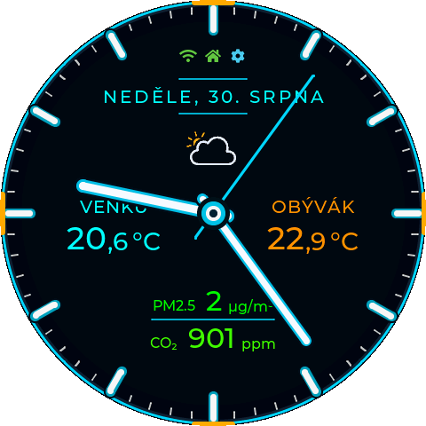
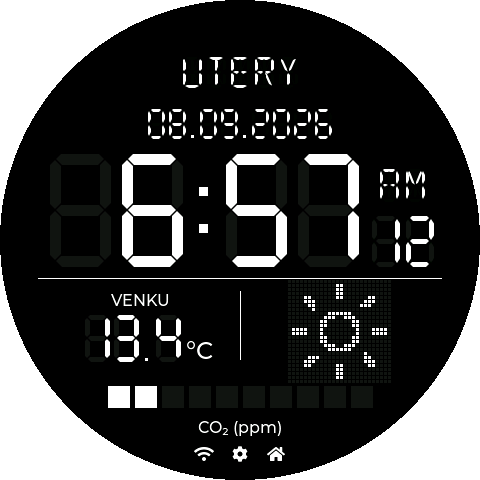
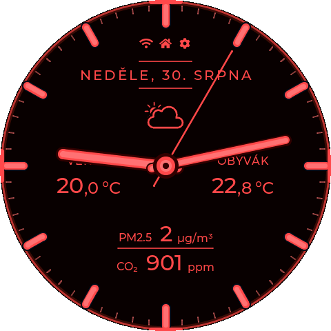
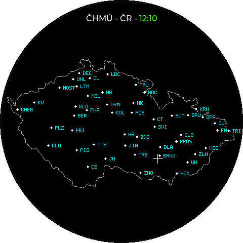

# Waveshare Hodiny

🇨🇿 **[Česká dokumentace](README.md)**

An open-source information dashboard for the round 480 × 480 px
[Waveshare ESP32-S3-Touch-LCD-2.1](https://www.waveshare.com/esp32-s3-touch-lcd-2.1.htm).
It displays time, date, weather, temperatures, additional sensor values and
precipitation radar data from the Czech Hydrometeorological Institute (CHMI).
Values can come from Open-Meteo without an account, optionally extended with
personal TMEP.cz sensors, or from Home Assistant. Appearance, data sources,
location, radar, brightness, animations and updates are configured in a web
interface without editing source code.

<p align="center">
  <a href="https://coolajz.github.io/waveshare-hodiny/">
    
  </a>
</p>

<p align="center">
  <strong>Simple USB installation without downloading files.</strong><br>
  Open the installer in desktop Chrome or Edge, connect the display and follow the guided steps.
</p>

---

<p align="center">
  
</p>

<p align="center">
  
  
</p>

<p align="center">
  
  
  
</p>

The project is Czech and the firmware defaults to Czech. English can be selected
in the device web configuration; the setting is stored persistently and also
changes the system text and verbal date shown on the display.

The forecast's center temperature uses an optional HA temperature sensor set in
Weather → Forecast, then HA weather temperature, then current Open-Meteo data for
the selected location. HA sources apply only when HA is active and configured;
other displayed values are never used as a fallback. The temperature sensor does
not change the weather icon or hourly forecast.

The hourly forecast page shows the next twelve whole hours, with
temperature badges, larger shadowed day/night icons and a temperature-colored
angular gradient, a solid current-temperature center and a time divider starting at its edge, separating the end and start of the forecast without blending across it. Swipe horizontally between the clock, forecast and radar pages.
Current weather appears in the center; vertical swipes cycle the three clock faces.
It also fetches Open-Meteo forecasts when Home Assistant supplies the other values.
Automatic rotation has independent clock, forecast and radar durations. Zero skips
a page; all-zero durations leave the current page unchanged even when enabled.

## Features

- digital clock with Barlow, Liberation Sans, LCD DSEG and Doto fonts, or an
  analog dial with a configurable tone and optional cardinal accents,
- Retro LCD with segmented time, two A/B values, fixed digit positions,
  and configurable background and foreground colors,
- multiple date formats and an optional seconds ring,
- NTP time synchronization and a location-based time zone with automatic daylight saving time,
- Open-Meteo support without an account or token,
- Home Assistant entities read through its REST API,
- two generic top values with individual names, units, precision, icons and
  smooth color scales,
- static and animated weather icons based on Meteocons,
- a separate twelve-hour Open-Meteo forecast page with current conditions in the center,
- CHMI precipitation radar with a Czech map, cities and 1–15 frames,
- 25, 50, 100 and 200 km radar ranges plus a full-country view,
- optional automatic rotation between clock, forecast and radar with independent durations,
- two additional values such as CO₂, VOC, particulate matter, humidity,
  pressure or battery level,
- personal TMEP.cz sensors as an optional extension to Open-Meteo values,
- custom units, decimal precision and smooth color scales,
- independent day and night brightness with manual or automatic switching,
- dots, line and comet seconds effects,
- password-protectable web configuration, backup import/export and diagnostics,
- initial Wi-Fi provisioning through Improv Serial on either USB-C connector,
- A/B OTA updates that preserve Wi-Fi and device configuration,
- a Home Assistant control API protected by a random secret,
- API display notifications with a title, multiline message, colors, optional beep,
  timeout or tap-to-dismiss behavior,
- basic settings directly on the touchscreen.

## Required hardware

The firmware is designed exclusively for **Waveshare ESP32-S3-Touch-LCD-2.1**
with a 480 × 480 px display and 16 MiB flash. Its ST7701 display, CST820 touch
controller, PSRAM, pin configuration and partition table match this exact board.

Do not flash the binary to another product merely because it also contains an
ESP32-S3. A different pinout or flash layout may prevent the device from booting.

## Installation

### Browser installation

The public [GitHub Pages installer](https://coolajz.github.io/waveshare-hodiny/)
can flash a stable release from desktop Chrome or Edge over USB. The installer
supports Czech and English. On first visit it uses Czech for browser languages
`cs` and `sk`; every other browser language uses English. The flag buttons in
the header switch the language manually.

Factory installation uses all four binary parts and the exact offsets declared
by the release `manifest.json`. The standalone `.ota.bin` file is an application
OTA image and must not be used as a factory image.

### Wi-Fi provisioning

Public releases contain no preconfigured Wi-Fi credentials. The installer can
configure the network through Improv Serial on either USB-C connector. If that
step is skipped or the stored network cannot be reached during startup, the
clock displays a QR code and starts a secured Wi-Fi access point with a captive
portal. Scan the code with a phone, select a discovered 2.4GHz network and enter
its password.

The new credentials are first stored as pending and the clock restarts. They
replace the last verified network only after a successful connection on the
next startup. If the connection fails, onboarding opens again and the previous
working credentials remain available.

The board exposes one USB–UART connector through CH343P and one native ESP32-S3
USB connector. Production firmware handles Improv Serial on both transports.

## First start

1. Install the firmware and provision Wi-Fi through Improv Serial, or skip that
   step and use the QR onboarding screen on the clock.
2. Wait for the device to connect; its IP address appears in the settings screen.
3. Open `http://waveshare-hodiny.local/`. Use the displayed IP address if mDNS
   is unavailable on your network.
4. Select Open-Meteo with TMEP.cz or Home Assistant and search for the device
   location. It determines the clock time zone, Open-Meteo weather location
   and radar center, including when Home Assistant supplies the data.
5. For Home Assistant, enter its URL and a long-lived access token, then test
   the connection.
6. Configure the dashboard, radar and brightness and save the changes.

A clean configuration uses Open-Meteo, Brno as the location and the full Czech
Republic radar view. Home Assistant is optional.

## Data sources

### Open-Meteo

Open-Meteo is the default source and requires no account or token. It supplies
the current weather and four configurable values. The selected city coordinates
also define the center of local CHMI radar views. Each of the four slots can
independently display 0–2 decimal places; the same setting also applies when a
TMEP.cz value is selected.

### TMEP.cz as an Open-Meteo extension

Your own TMEP.cz sensors can be added to Open-Meteo mode. Paste the complete URL
from **Extended JSON – with all sensors**, select **Verify and load sensors**, and
values from up to 32 sensors are appended to the same four selectors under a
TMEP.cz group. The firmware uses the unit returned by the export, including for
custom quantities.

When at least one TMEP value is selected, the complete export is fetched with
one HTTPS request every minute. With no selected TMEP value, the catalog is
loaded once after boot and is not refreshed periodically. Opening the web
configuration displays the cached catalog first and refreshes it from TMEP.cz
at most once per page load. Open-Meteo continues to refresh independently every
10 minutes.

The firmware extracts the ID and export key and always builds the request with
`extended=1&all=1`. These credentials remain stored on the device and are never
returned by the configuration API. They are included in the encrypted full backup. **Remove TMEP.cz** clears the URL,
catalog, diagnostics and TMEP assignments; affected slots return to their
default Open-Meteo values.

Example export URL:
`https://tmep.cz/vystup-json.php?id=11746&export_key=XXXXXXXXsd&extended=1&all=1`

### Home Assistant

The firmware reads individual entities through the Home Assistant REST API. It
does not require MQTT, a custom integration or an administrator account.

Create a dedicated long-lived access token in the Home Assistant user profile
and use an account with only the permissions the clock requires. After saving,
the token is never returned to the browser and can only be replaced.

The current firmware permits local HTTP and HTTPS Home Assistant servers with a
self-signed or otherwise invalid certificate. Certificate validation is therefore
disabled for this Home Assistant connection only. Use it on a trusted LAN and be
aware that this does not protect the token from an active network attacker.

Suggested entities:

| Value | Example entity | Notes |
| --- | --- | --- |
| Weather | `weather.home` | Text state or supported numeric code |
| Sun | `sun.sun` | Controls automatic day/night mode |
| Left value | `sensor.outdoor_temperature` | Temperature, CO₂, PM, pressure or any numeric sensor |
| Right value | `sensor.living_room_co2` | Temperature, CO₂, PM, pressure or any numeric sensor |
| Value A/B | `sensor.living_room_co2` | CO₂, VOC, PM, humidity, pressure, etc. |

Unavailable or invalid values are displayed as `--`.

## Web configuration

<p align="center">
  
</p>

The web interface configures:

- the device language; until a choice is stored, the display remains in Czech
  and the first web visit stores Czech for `cs`/`sk` browsers or English for
  every other browser language; later visits use the stored device setting and
  the fixed web header provides flag buttons for changing it at any time,
- the data source and shared geographic location,
- Home Assistant URL, token, weather and sun entities,
- an optional HA sensor overriding the forecast's current center temperature,
- left and right top values with type, name, unit, precision, icon and color
  scale,
- `Monochrome`, `Flat` and `Line` animated weather icon styles,
- CHMI radar range, map opacity, frame count, pause and automatic rotation,
- custom values, units, precision and color scales,
- clock and date colors, fonts, date format and seconds effects,
- day/night brightness and automatic switching,
- automatic OTA updates and web-server availability,
- an optional web password,
- backup import/export, restart, display controls and live diagnostics.

### Hourly weather forecast

The forecast is a separate page, not a fourth clock face. Swipe horizontally
through **Clock → Forecast → Radar → Clock**, or in reverse. Outside Czechia,
the radar is omitted and you switch between clock and forecast.

The next **twelve whole hours** appear around the dial with temperatures and
day/night weather icons. A smooth temperature-colored fan shows the expected
temperatures; a radial divider separates the start and end of the time range.
Current weather and temperature appear in the center. Times use the saved
location's time zone, and red night mode applies the night palette.

Hourly data always comes from Open-Meteo for the saved location, even when
Home Assistant supplies the clock's other values. No account or API token is
required. Successful requests refresh approximately every ten minutes; failed
requests schedule another attempt after one minute. Missing hourly values are
not displayed as 0 °C.

The current center temperature uses this priority:

1. The optional HA temperature sensor in **Weather → Forecast**.
2. Temperature from the active HA weather entity.
3. Current Open-Meteo temperature for the saved location.

HA sources apply only when Home Assistant is active and configured. Supported
sensor units are °C, °F and K, converted to °C. An unavailable value or unsupported
unit falls back to the next source. This setting does not change the weather
icon or hourly forecast; top values and metrics A/B are not fallback sources.

### Automatic page rotation

Enable automatic screen rotation in the web interface and configure each page
for 0–3600 seconds. Default durations are clock 120 s, forecast 20 s and radar
20 s; rotation itself is disabled after a clean installation. **0 skips a page**;
all-zero durations leave the current page unchanged. Manual swipes can still
open pages excluded from automatic rotation.

Rotation requires Wi-Fi and synchronized time. It pauses in settings, with the
display switched off or while a notification is active. A loading/unavailable
radar is temporarily skipped without stalling clock/forecast rotation. Outside
Czechia, only clock and forecast rotate. Radar finishes its current animation
cycle before leaving, so its configured duration is a minimum.

### CHMI precipitation radar

Radar imagery comes from the open MAX_Z composite published by the Czech
Hydrometeorological Institute. Views cover 25, 50, 100 or 200 km around the
saved coordinates, or the whole Czech Republic. The map includes the national
outline and a range-specific selection of cities.

The radar is available only when Open-Meteo location search identifies the
saved country as `CZ`. For locations outside Czechia, the firmware does not
start the radar, download its data in the background or respond to radar
gestures, and automatic screen rotation skips the radar. Open-Meteo weather and
Home Assistant remain available without this restriction.

One frame creates a static view; 2–15 frames create an animation from oldest to
newest. The pause after the newest frame is configurable from 0 to 30 seconds
and defaults to 5 seconds. In day mode the newest timestamp is bright green. A
thin bar below the caption shows animation progress and turns red while an
empty cache is being fully prepared. New imagery is checked in fixed
five-minute slots, approximately one minute after the CHMI publication time.

The red night appearance converts the map, cities, location marker, labels and
precipitation intensity levels to shades of red. The newest timestamp then uses
the same red as the other text. Changing the appearance reuses the prepared
cache and does not download or rebuild the animation.

The web range buttons preview a view immediately. Blue marks the range currently
shown on the clock and amber marks the saved default. The preview becomes
persistent only after saving the configuration. A range selected on the device
is temporary and the saved web value is restored after a restart.

Automatic rotation is disabled by default and provides separate clock, forecast and radar
durations. The radar duration is a minimum: an animation already in progress,
including its final pause, always completes before switching pages. After a
restart, background cache preparation begins only after Wi-Fi is connected and
time synchronization has completed. The first automatic transition waits for
the complete animation before including the radar, without blocking other pages;
playback then starts immediately from the oldest frame.
With automatic rotation disabled, radar data is not downloaded in the
background and loading starts when the radar is opened manually.

### Color scales

Each additional value supports up to ten `value → color` points. The firmware
interpolates between neighboring points, producing a smooth scale rather than
hard color thresholds. The two values use independent scales.

### Day/night mode and seconds

Day and night brightness are independent. Automatic mode uses Open-Meteo sunrise
and sunset for the selected location or a Home Assistant sun entity. Optional
offsets adjust both transitions. With automation disabled, a short tap on either
the clock or radar switches the day and night appearance.

The configuration web server defaults to **Always on**. It can instead remain
available for ten minutes after startup or activation from the device, or be
disabled completely. Use it only on a trusted network; the dashboard gear icon
indicates an active configuration server. An optional 6–20 character password
protects web settings. The **System** tab shows an unprotected state in red and
an active password in green. Only a derived hash is stored, and the password is
included only in encrypted full backups.

### Diagnostics and backups

The read-only `/diagnostics` page reports firmware, CPU, flash, current display
pixel clock, current and minimum internal RAM and PSRAM, Wi-Fi, Home Assistant,
Open-Meteo and TMEP.cz runtime state. Radar details include the selected city, GPS,
range, prepared-frame count and time span, last successful refresh, next check,
HTTP status and the file currently being processed. Encrypted `.whbackup` files contain the stored clock settings, appearance,
Home Assistant URL/token, TMEP credentials, web password verification record
and control API secret. Filenames include the source firmware version and export
date/time. **Wi-Fi is excluded and remains unchanged on restore.**
Export requires a confirmed password of 8–128 characters, at most 256 UTF-8
bytes. AES-256-GCM encryption/decryption runs in firmware on a worker task.
The password is not persisted; without it the backup cannot be restored.
Unsaved form changes and temporary previews are not exported. The password
still travels over local HTTP; encryption protects the file, not that transport.

The import dialog supports file selection and drag and drop. Its readable
header shows the source firmware version, configuration schema and creation
time (when synchronized). The header is authenticated with the encrypted
payload. A newer source firmware is a warning; schema support determines
compatibility. Supported older configurations migrate in memory before any
write. Unknown schemas, incorrect passwords and corrupt files are rejected.

Settings are written to an inactive copy, read back and atomically activated
with a persistent operation receipt. The UI verifies the receipt after restart,
including when restored authentication or web mode changes access. An uncertain
network result is not reported as success or automatically resubmitted.

Legacy unencrypted JSON format 2 remains importable without a backup password,
but cannot restore missing credentials. An existing HA token is retained only
for the same URL; missing TMEP credentials do not block saving its slots.
Firmware predating the new settings store can only read the legacy settings
left before the transition. Later changes do not migrate backwards automatically;
keep a suitable backup before downgrading.
See [the backup format and storage contract](docs/configuration-backup.md).

## Touchscreen settings

Long-press on the clock, forecast or radar to open the settings pages.
Horizontal swipes cycle through clock, forecast and radar; the opposite direction
cycles back. Outside Czechia, only clock and forecast are available.
On the clock, swiping up cycles Digital → Analog → Retro LCD; swiping down
cycles in reverse. This is temporary: restart restores the saved clock face.
With animated transitions enabled, faces slide vertically in the swipe
direction over 500 ms; otherwise they switch immediately.
On the radar, swiping up zooms in and swiping down zooms out; this range change
remains temporary until restart. Vertical swipes on the forecast do not change
the clock face or radar range. With automatic day/night mode disabled, a
short tap on a main page switches the appearance. A tap on an active notification
dismisses it instead. Arrow buttons move between
the three settings pages; swipes are not used inside the settings menu.
Available controls include day/night brightness, automatic mode, weather icons,
seconds effects, web-server mode and OTA checks.

## Animated Meteocons

Static monochrome icons are compiled into the firmware. Public animated icons
are downloaded from GitHub Pages and cached locally. Night mode always uses the
monochrome animation style so the icons follow the red night palette.

Only assets referenced by the firmware allowlist are published. See
[`METEOCONS_ASSET_PIPELINE.md`](METEOCONS_ASSET_PIPELINE.md) for the reproducible
asset-generation process and third-party attribution.

## OTA updates

Release firmware uses two equal 6 MiB application slots. Public builds read OTA
metadata and the application image only from the trusted GitHub Pages origin.
Before activating an image, the updater verifies HTTPS, HTTP status, declared
and received size, SHA-256, ESP32-S3 chip family and inactive-partition capacity.

If validation or writing fails, the running firmware remains active. Wi-Fi and
configuration in NVS and `clockcfg` survive a normal OTA update. A factory flash
or full erase is a separate operation and may remove user data.

Version 1.6.0 contains one historical configuration migration from public
version 1.5.5. It preserves the existing data source, Home Assistant settings,
entities and appearance, adds the radar options with the full-country view and
six frames, and leaves automatic rotation disabled. Intermediate development
schemas are not maintained as separate migration steps.

Automatic updates are disabled after a clean installation. When enabled, the
firmware checks at most once per local calendar day after 04:10. Manual and
automatic updates use the same implementation and validation.

## Home Assistant control API

The web interface shows a control endpoint containing a random 128-bit secret.
It can refresh data, control the backlight and invoke other supported actions.
Treat the URL as a credential and never publish it in screenshots, logs or Git.

### Display notifications

Use `POST /api/control/<SECRET>/notification` with JSON or form-encoded data.
The **System → Web server and API** notification tester displays the exact URL
and JSON with copy buttons. Test values are not saved in the clock configuration.
The endpoint also works when web settings are password-locked.

| Field | Meaning |
| --- | --- |
| `title` | Required, 1–96 UTF-8 bytes; single line. |
| `message` | Required, 1–768 UTF-8 bytes; supports `\n`. |
| `durationSeconds` | Integer 0–86400; omitted or 0 = until tapped. |
| `beep` | Integer 0–5000 milliseconds; omitted or 0 = silent. |
| `textColor` | `#RRGGBB`, default `#FFFFFF`. |
| `backgroundColor` | `#RRGGBB`, default `#000000`. |

A tap dismisses either timed or fixed notifications. New requests replace the
previous notification; there is no queue or persistence across restart. Sound
and the timeout start only after the first successfully presented display frame,
not when the HTTP request arrives. A new notification replaces the previous beep;
zero/omitted `beep` cancels it. Red night mode uses red text on black, restoring
request colors on return to day mode. Brightness-only night mode keeps the colors.
Notifications overlay the current page and pause gestures/automatic rotation.
Long text is truncated with an ellipsis; Latin text and Czech diacritics are
supported, not emoji or other alphabets.

Success returns HTTP 200, for example
`{"ok":true,"active":true,"durationSeconds":15,"beep":150,"replaced":false}`.
Errors include 400 (invalid fields), 401 (wrong secret), 415 (unsupported content
type), 409 (display manually off or firmware update busy), and 503 (notification
or requested buzzer unavailable). Invalid requests leave the previous overlay
unchanged. JSON requires actual numbers, not strings, and has a 4096-byte body
limit. Form values have a 1024-byte encoded-value limit. Notifications respect
brightness; starting firmware installation dismisses them.

#### cURL

Timed notification with a 150 ms beep (replace the placeholder IP and secret):

```bash
curl --fail-with-body --show-error --max-time 10 \
  --request POST 'http://DISPLAY_IP/api/control/SECRET/notification' \
  --header 'Content-Type: application/json' \
  --data '{"title":"Laundry finished","message":"You can hang up the laundry.","durationSeconds":15,"beep":150,"textColor":"#FFFFFF","backgroundColor":"#124734"}'
```

Fixed, silent notification with a newline:

```bash
curl --fail-with-body --show-error --max-time 10 \
  --request POST 'http://DISPLAY_IP/api/control/SECRET/notification' \
  --header 'Content-Type: application/json' \
  --data '{"title":"Open window","message":"The bedroom window is open.\nClose it before leaving.","durationSeconds":0,"beep":0}'
```

`--fail-with-body` requires cURL 7.76 or later. Use `--fail` on older versions
(without the error response body).

#### Node-RED

Connect standard **Inject → Function → HTTP request → Debug** nodes; no extra
package is required. Set the Node-RED process environment variable
`WAVESHARE_NOTIFICATION_URL` to the full notification URL from the clock's web
interface and restart Node-RED. Keep the real URL out of shared flow exports.

Paste this into the **Function** node:

```javascript
const url = env.get("WAVESHARE_NOTIFICATION_URL");
if (!url) {
    node.error("Missing WAVESHARE_NOTIFICATION_URL");
    return null;
}

msg.url = url;
msg.headers = { "Content-Type": "application/json" };
msg.payload = JSON.stringify({
    title: "Laundry finished",
    message: "You can hang up the laundry.\nTap to dismiss.",
    durationSeconds: 15,
    beep: 150,
    textColor: "#FFFFFF",
    backgroundColor: "#124734"
});
return msg;
```

Set **HTTP request** to **POST**, leave its URL blank to use `msg.url`, and
return a parsed JSON object. Debug only `msg.payload`, not the entire message
containing the secret URL. An optional second Debug node can show
`msg.statusCode`: success is 200 with `msg.payload.ok` equal to `true`.
Deploy and click Inject. Set `durationSeconds` to 0 for a fixed overlay or
`beep` to 0 for silence. Replace Inject with an event/automation later;
always use `JSON.stringify` when building messages from your own data.

See the official Node-RED recipes for [msg.url](https://cookbook.nodered.org/http/set-request-url),
[request headers](https://cookbook.nodered.org/http/set-request-header), and
[JSON responses](https://cookbook.nodered.org/http/parse-json-response).

#### Home Assistant: notify action

The [RESTful Notifications](https://www.home-assistant.io/integrations/notify.rest/)
platform provides `notify.waveshare_hodiny` without a custom integration or HA
token. Authorization uses the clock's secret URL. Home Assistant must have
network access to the clock's web server.

Add the real URL to your local `secrets.yaml`; never publish it:

```yaml
waveshare_notification_url: "http://DISPLAY_IP/api/control/SECRET/notification"
```

Add this entry to `configuration.yaml`. If `notify:` already exists, append to
its list instead of declaring a second top-level key.

```yaml
notify:
  - platform: rest
    name: waveshare_hodiny
    resource: !secret waveshare_notification_url
    method: POST
    message_param_name: message
    title_param_name: title
    data:
      durationSeconds: "{{ (data | default({})).get('durationSeconds', 15) }}"
      beep: "{{ (data | default({})).get('beep', 0) }}"
      textColor: "{{ (data | default({})).get('textColor', '#FFFFFF') }}"
      backgroundColor: "{{ (data | default({})).get('backgroundColor', '#000000') }}"
```

Check configuration and restart Home Assistant. Test this YAML under
**Developer tools → Actions**, or add it as a list item under automation
`actions:` or script `sequence:`:

```yaml
action: notify.waveshare_hodiny
data:
  title: "Laundry finished"
  message: |-
    You can hang up the laundry.
    Tap to dismiss.
  data:
    durationSeconds: 15
    beep: 150
    textColor: "#FFFFFF"
    backgroundColor: "#124734"
```

Nested `data:` belongs to the HA notify interface, not the clock API. The
notifier extracts only the four supported options. Omitting nested `data:`
defaults to 15 seconds, silence and white text on black. Send `durationSeconds: 0`
to keep the message until tapped. Always supply both `title` and `message`.
Use **POST** (form data), not **POST_JSON**: notifier templates render strings,
which the clock's form parser accepts as integers. Keep messages short because
the encoded form-value limit applies. Use a trusted local network or VPN;
do not expose the clock API to the internet or publish its URL in logs/screenshots.

## Building from source

### Dependencies

The verified toolchain uses Arduino CLI, Arduino ESP32 core `3.0.7`, LVGL
`8.3.10`, PNGdec `1.0.1` and Python 3. Do not substitute board options or flash
parameters from another ESP32-S3 board.

```bash
arduino-cli core install esp32:esp32@3.0.7 --config-file arduino-cli.yaml
arduino-cli lib install lvgl@8.3.10 --config-file arduino-cli.yaml
arduino-cli lib install PNGdec@1.0.1 --config-file arduino-cli.yaml
```

### Development build

```bash
./build.sh
./upload.sh
```

`./build.sh` uses the default home credentials from `WIFI_SSID` and
`WIFI_PASSWORD`. Run `./build.sh work` to use the separate
`WIFI_WORK_SSID` and `WIFI_WORK_PASSWORD` values.

Pass a serial port explicitly when needed:

```bash
./upload.sh /dev/cu.usbmodemXXXXXXXX
```

The development build retains USB diagnostics, screenshot commands and local
development defaults. It does not install a public OTA release automatically.

### Optional local `.env`

The entire `.env` file is ignored by Git. It can supply local Wi-Fi, Home
Assistant and Firmware Hub variables used by the existing generators. Never
commit real credentials. Generated headers belong only in the ignored
`WaveshareHodiny/local/` directory.

```dotenv
WIFI_SSID=
WIFI_PASSWORD=
WIFI_WORK_SSID=
WIFI_WORK_PASSWORD=
```

### Release build

On ARM Macs, `build.sh`, `build-release.sh`, and `upload.sh` share native tools
without Rosetta. Python esptool 4.6 and Arduino ctags 5.8-arduino11 are cached
in the ignored `.arduino/native-tools` directory. Missing tools are prepared
automatically by `tools/setup_native_arduino_tools.sh`. Initial preparation
requires internet access, Python with pip, and Command Line Tools. Python
dependencies are separated by interpreter version. Linux CI is unchanged.

Choose a valid SemVer version and build in the separate release workflow:

```bash
./build-release.sh 1.0.0
```

A release build must contain no Wi-Fi credentials and must keep Improv Serial
available on both USB-C connectors. Publishing a release is a separate,
explicitly authorized operation.

## USB screenshots

The development firmware supports framebuffer capture over its USB diagnostic
protocol. Use the repository script with the currently verified serial port:

```bash
./capture-screenshot.sh /dev/cu.usbmodemXXXXXXXX
```

## Repository layout

- `WaveshareHodiny/` – firmware source and embedded web interface,
- `docs/` – public installer and OTA/weather assets for GitHub Pages,
- `screenshots/` and `media/` – documentation media,
- `tools/` – generators and release validation tools,
- `build.sh` – development build,
- `build-release.sh` – isolated release build and package validation.

## Troubleshooting

- If `waveshare-hodiny.local` does not open, use the IP address shown on the
  device and check whether the web server is enabled.
- If the Home Assistant test fails, verify the URL, token, network reachability
  and entity IDs.
- A persistent `--` means the value is missing, unavailable or not numeric.
- OTA installation is available only in a compatible release build and only
  after a newer compatible version has been found.
- If USB is not detected, try a data-capable cable, the other USB-C connector
  and a direct computer port without a hub.

## Security and privacy

- Public releases contain no Wi-Fi credentials.
- Home Assistant tokens are stored locally and are not returned by the API.
- Backups omit tokens, passwords and the control API secret.
- OTA uses HTTPS and verifies the application image before activation.
- The configuration web server is intended for a trusted local network.
- Do not publish control URLs, credentials, `.env` files or generated secret
  headers.

## Acknowledgements

- [Waveshare](https://www.waveshare.com/) for the hardware and documentation,
- [LVGL](https://lvgl.io/) for the embedded graphics library,
- [Meteocons](https://meteocons.com/) for weather icon artwork,
- [Open-Meteo](https://open-meteo.com/) for weather data,
- [CHMI](https://www.chmi.cz/) for open precipitation radar data,
- [Home Assistant](https://www.home-assistant.io/) for the automation platform.

I used and adapted parts of Petr's open-source
[MeteoPlaneRadar](https://github.com/petus/MeteoPlaneRadar) project from
[Chiptron.cz](https://chiptron.cz/) while implementing the radar. Thank you for
publishing the project, the practical CHMI radar-data example and the map data
that made this integration possible.

## License

The project is licensed under the [MIT License](LICENSE). Third-party components
and assets are listed in [THIRD_PARTY_NOTICES.md](THIRD_PARTY_NOTICES.md).

Digital and Retro LCD faces support a shared 24/12-hour format with AM/PM, independent of language; the default is 24-hour time. The leading hour zero setting is shared too; LCD retains the first digit’s inactive segments when it is disabled.

## Location-based time zone

Selecting a city retrieves its time zone from Open-Meteo and saves it with
the location. The interface language does not affect the time zone. Daylight
saving time changes automatically according to regional rules; no manual
switch is needed. The clock, radar frame times and daily update checks use
the same zone. NTP continues to synchronize the underlying UTC time.

When upgrading an older configuration or importing an older backup, a missing
zone is resolved from the saved coordinates, including with Home Assistant
as the data source. Until resolution succeeds, the previous Czech zone remains
active and automatic update checks wait. A fresh configuration starts with
Brno and `Europe/Prague`.

Once synchronized, the clock keeps running during Wi-Fi outages and saved
rules allow offline transitions. After a restart, NTP is needed to obtain the
correct time. Embedded IANA 2026c data covers 2020–2100, including irregular
transitions; subsequent legislative changes require a firmware database
update. See `tools/generate_timezones.py` for the source and generator.

LCD offers “Fixed weekday positions” (disabled by default): 7 positions in Czech and 9 in English, with inactive characters around shorter names. Disabling it restores the precisely centered name without surrounding positions.

LCD date format is configurable independently: day–month–year, month–day–year, or year–month–day, with dots, dashes, or slashes depending on the layout. Each layout offers a variant without leading zeros that retains blank positions and inactive segments. The default is DD.MM.YYYY.


### Web performance and live clock preview

Both development and release scripts generate gzip page and translation assets with
`tools/generate_web_assets.py`. The ignored output at
`WaveshareHodiny/local/ConfigurationAssets.h` is refreshed from source during builds.
The ESP32 serves the prepared bytes from flash without runtime compression.
Direct compilation without that header falls back to the original page; rerun the
generator when directly compiling after web source changes.

Digital immediately previews the font, time/date colors, date format, leading zero,
colon, side icon colors, and seconds effect settings. These previews do not write
flash or resynchronize the LCD. Press **Save** to persist them. Network settings and
data sources still apply when saved.

Digital, Analog, and Retro LCD previews share a queue: rapid changes are coalesced
for 120 ms, with at most one request in flight. Saving waits for pending previews
and prevents form edits during the write. The saved transaction identifier is still
verified, without a fixed one-second delay. Firmware status no longer blocks the
form, and the memory overview requests a compact diagnostic response.
