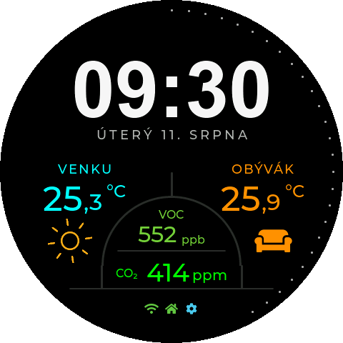
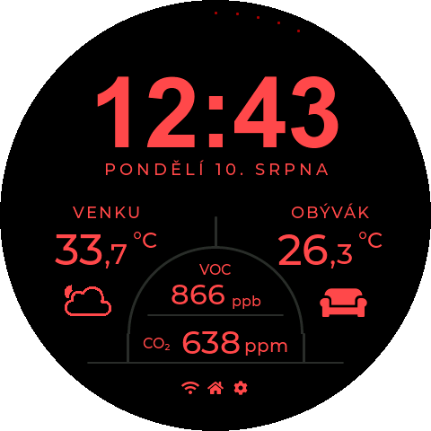
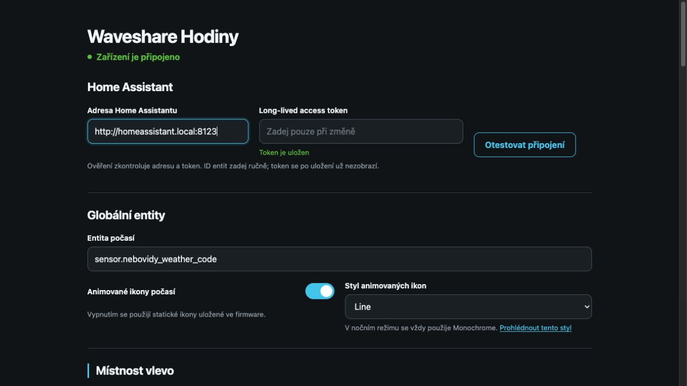
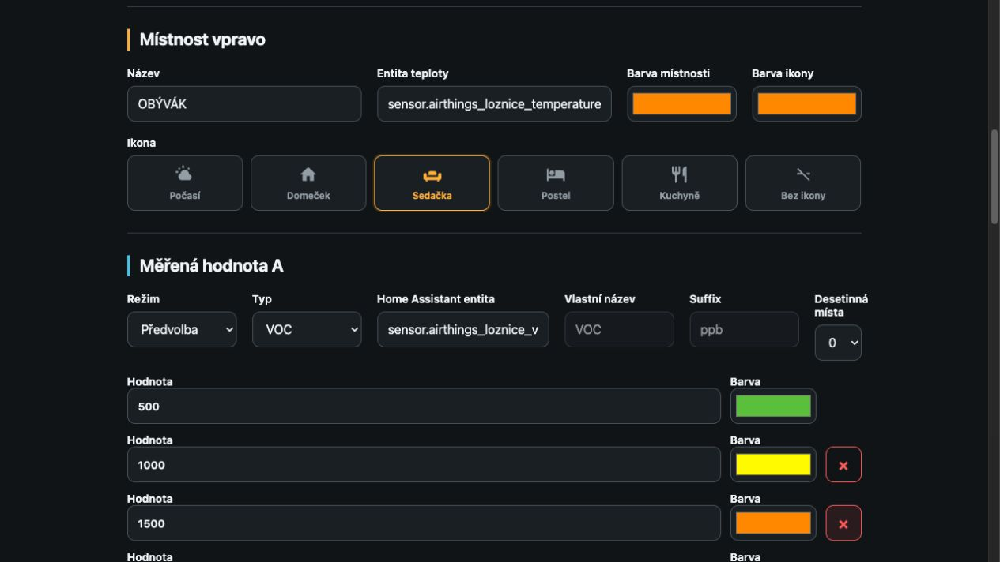
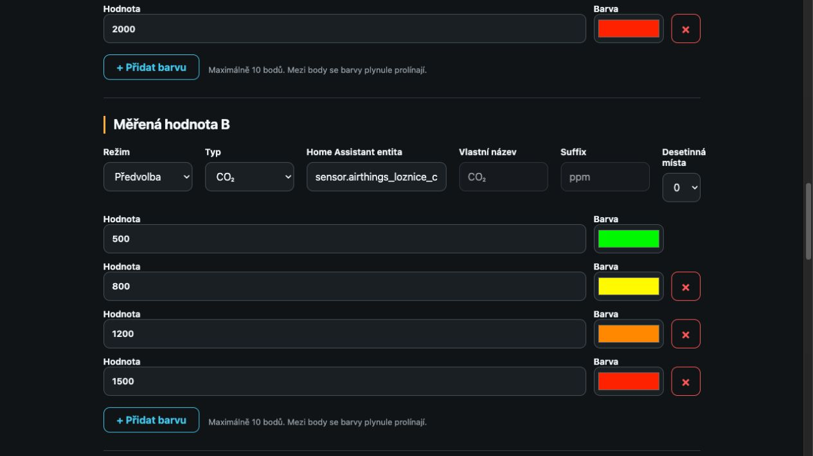
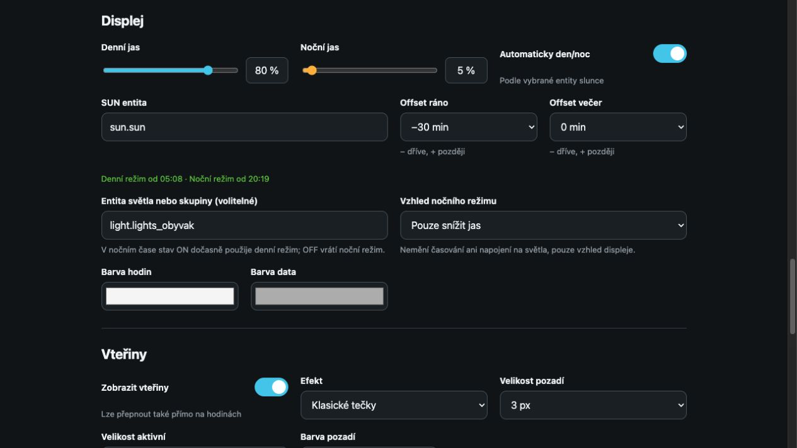
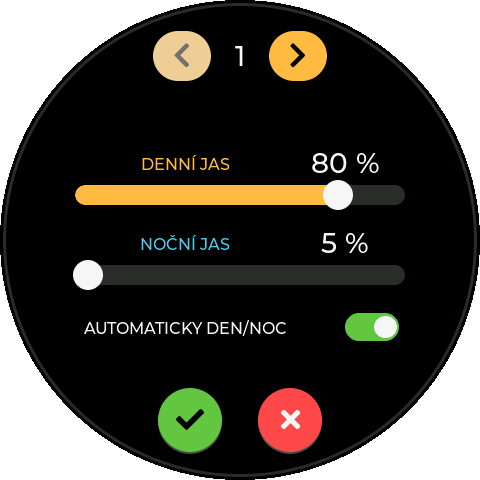
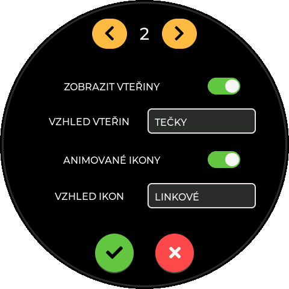
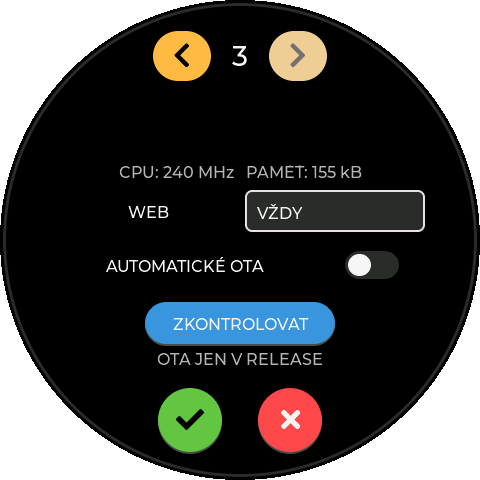

# Waveshare Hodiny

Český informační dashboard pro kulatý dotykový displej
[Waveshare ESP32-S3-Touch-LCD-2.1](https://www.waveshare.com/esp32-s3-touch-lcd-2.1.htm)
s rozlišením 480 × 480 px. Zobrazuje čas, datum, počasí, teploty a další
hodnoty z Home Assistantu. Vzhled, entity, jas, animace i aktualizace se
nastavují z webového rozhraní bez úpravy zdrojového kódu.

<p align="center">
  
  
</p>

V denním režimu mají místnosti a hodnoty vlastní barvy. Volitelný červený
noční vzhled sjednotí celý dashboard do odstínů červené a sníží jas, aby
displej v noci nerušil.

## Co firmware umí

- velké digitální hodiny s volitelným běžným nebo LCD fontem, české datum a vteřinový prstenec,
- synchronizaci času přes NTP a české časové pásmo včetně letního času,
- dvě místnosti s vlastním názvem, teplotou, ikonou a barvou,
- animované i statické ikony počasí založené na Meteocons,
- dvě další měřené veličiny, například CO₂, VOC, vlhkost, tlak nebo baterii,
- vlastní jednotky, počet desetinných míst a plynulé barevné škály,
- denní a noční jas s automatickým přepínáním podle entity slunce,
- tři efekty vteřin: klasické tečky, plynulou čáru a kometu,
- webovou konfiguraci, export a import zálohy a bezpečný restart,
- prvotní nastavení Wi-Fi přes Improv Serial,
- A/B OTA aktualizace se zachováním Wi-Fi a konfigurace,
- ovládací API pro Home Assistant chráněné náhodným secretem,
- základní nastavení také přímo na dotykovém displeji.

## Potřebný hardware

Firmware je určený výhradně pro **Waveshare ESP32-S3-Touch-LCD-2.1** s
480 × 480 px displejem a 16MiB flash. Konfigurace pinů, displeje ST7701,
dotyku CST820, PSRAM a partition table odpovídá této konkrétní desce.

Desku můžete zakoupit u českých prodejců:

<p align="center">
  <a href="https://pajenicko.cz/waveshare-esp32-s3-touch-lcd-2.1-s-kulatym-ips-lcd-dotykovym-displejem"></a>&nbsp;&nbsp;&nbsp;&nbsp;
  <a href="https://www.laskakit.cz/waveshare-esp32-s3-round-2-1--480--480-ips-touch-wifi-modul/"></a>
</p>

Nepoužívejte tento binární obraz na jiném modelu jen proto, že také obsahuje
ESP32-S3. Odlišný pinout nebo flash layout může zabránit startu zařízení.

## Instalace pro běžného uživatele

### Instalace z prohlížeče

Veřejná [instalační stránka na GitHub Pages](https://coolajz.github.io/waveshare-hodiny/)
umožňuje nahrát stabilní release přímo z desktopového Chromu nebo Edge přes
USB. Instalační tlačítko se zpřístupní, jakmile je na GitHubu dostupný veřejný
stabilní release se zkontrolovaným čtyřdílným factory balíčkem.

Do té doby lze použít release balíček s manifestem v
[ESP Web Tools](https://web.esphome.io/) nebo firmware sestavit ze zdrojů
podle kapitoly [Sestavení ze zdrojů](#sestavení-ze-zdrojů). Factory instalace
vyžaduje všechny části a přesné offsety uvedené v release `manifest.json`;
samostatný aplikační `.ota.bin` není factory obraz.

### Nastavení Wi-Fi

Veřejný release neobsahuje přednastavené Wi-Fi údaje. Po instalaci připoj
zařízení jedním z jeho USB-C konektorů a použij Improv Serial v instalační
stránce. Zadané SSID a heslo se uloží do NVS a po restartu zůstanou zachované.

Deska má USB–UART konektor přes CH343P a nativní USB konektor ESP32-S3.
Produkční firmware obsluhuje Improv Serial na obou konektorech.

## První spuštění

1. Nainstaluj firmware a nastav Wi-Fi přes Improv Serial.
2. Počkej na připojení; na displeji se zobrazí IP adresa a stavové ikony.
3. Otevři `http://waveshare-hodiny.local/`. Pokud mDNS v síti nefunguje,
   použij IP adresu z nastavení na displeji.
4. Zadej adresu Home Assistantu a long-lived access token.
5. Tlačítkem **Otestovat připojení** ověř spojení.
6. Vyplň entity, vzhled a jas a zvol **Uložit nastavení**.

## Home Assistant

Firmware čte jednotlivé entity přes REST API Home Assistantu. Nepotřebuje
MQTT, vlastní integraci ani administrátorský účet.

### Vytvoření tokenu

V Home Assistantu otevři svůj uživatelský profil, sekci **Long-lived access
tokens**, vytvoř nový token pro hodiny a vlož jej do webové konfigurace.
Použij účet pouze s oprávněními, která zařízení skutečně potřebuje.

Token se po uložení už do webové stránky neposílá a nelze jej z ní přečíst;
lze jej pouze nahradit. Při testu se uložený token znovu použije jen pro přesně
stejnou uloženou adresu Home Assistantu. Pokud adresu změníš, musíš zadat také
nový token.

Firmware podporuje lokální HTTP i HTTPS servery s vlastním nebo neplatným
certifikátem. U HTTPS spojení s Home Assistantem proto v současnosti neověřuje
certifikát serveru. Tato volba usnadňuje domácí instalace, ale nechrání token
před aktivním útočníkem v síti. Používej firmware pouze v důvěryhodné LAN.

### Doporučené entity

| Údaj | Příklad entity | Poznámka |
| --- | --- | --- |
| Počasí | `weather.domov` | Textový stav HA nebo podporovaný číselný kód |
| Slunce | `sun.sun` | Řídí automatický denní/noční režim |
| Venkovní teplota | `sensor.venkovni_teplota` | Libovolný číselný senzor |
| Pokojová teplota | `sensor.obyvak_teplota` | Libovolný číselný senzor |
| Hodnota A/B | `sensor.obyvak_co2` | CO₂, VOC, PM, vlhkost, tlak a další |

ID entit se zadávají ručně. Nedostupná nebo neplatná hodnota se na displeji
zobrazí jako `--`.

## Webová konfigurace

<p align="center">
  
</p>

Web umožňuje nastavit:

- Home Assistant URL, token, entitu počasí a entitu slunce,
- levou a pravou místnost včetně názvu, teploty, ikony a barev,
- styl animovaných ikon `Monochrome`, `Flat` nebo `Line`,
- měřené hodnoty A a B, jednotky, přesnost a barevné škály,
- barvu hodin, data a obou částí vteřinového efektu,
- denní/noční jas a automatický režim,
- automatické OTA aktualizace a režim webového serveru,
- export/import zálohy, restart a ovládání podsvícení.

### Barevné prahy měřených hodnot

Každá měřená hodnota může mít až deset dvojic **hodnota → barva**. Firmware
mezi sousedními body plynule interpoluje, takže změna barvy na displeji není
omezena jen na několik tvrdých stavů. Škály jsou nezávislé: například VOC může
používat jiné hranice než CO₂.

<p align="center">
  
  
</p>

### Jas, denní/noční režim a vteřiny

Denní i noční jas se nastavují samostatně. Automatika používá východ a západ
slunce s volitelným ranním a večerním offsetem. Volitelná entita světla může v
nočním čase dočasně aktivovat denní vzhled. Samostatně lze nastavit také barvu
hodin, data, typ vteřinového efektu, velikost a jas jeho aktivní i neaktivní
části.

<p align="center">
  
</p>

Konfigurační web zatím nemá vlastní heslo. Ve výchozím režimu běží deset minut
po startu a aktivita interval obnovuje. Otevření nastavení na hodinách jej znovu
aktivuje. Lze jej přepnout na **Vždy zapnutý** nebo **Vypnutý**. Provozuj jej
jen v důvěryhodné síti; aktivní web signalizuje ikona ozubeného kola na
dashboardu.

### Záloha konfigurace

Exportovaná JSON záloha obsahuje vzhled a ID entit, ale neobsahuje Home
Assistant token ani secret ovládacího API. Po importu proto může být nutné
citlivé hodnoty zadat znovu. Restart zařízení uložené nastavení nemaže.

## Nastavení na displeji

Dlouhým stiskem dashboardu otevřeš tři stránky nastavení. Velká tlačítka se
šipkami přepínají stránky; gesto swipe se nepoužívá.

<p align="center">
  
  
  
</p>

První stránka ovládá denní a noční jas a automatický režim. Druhá přepíná
vteřiny, jejich efekt a animované ikony. Třetí řídí režim webového serveru a
ruční kontrolu OTA. IP adresa je na veřejném snímku záměrně skrytá. Krátký
dotyk dashboardu při vypnuté automatice přepíná denní a noční režim.

## Animované Meteocons

Statické monochromatické ikony jsou uložené přímo ve firmware. Volitelné
animované ikony veřejného buildu se stahují z GitHub Pages a ukládají do
lokální cache. V nočním režimu se vždy použije monochromatický styl, aby ikony
respektovaly červené noční zobrazení.

V `docs/assets/weather-icons/` je pouze 42 GIFů používaných firmwarovým
allowlistem: 14 stavů pro každý ze stylů Monochrome, Flat a Line. Každý veřejný
manifest obsahuje skutečnou velikost a SHA-256 souboru; kompletní pracovní
mirror 1557 ikon v repozitáři není. Postup reprodukovatelného vytvoření je v
[`METEOCONS_ASSET_PIPELINE.md`](METEOCONS_ASSET_PIPELINE.md).

## OTA aktualizace

Release firmware používá A/B layout se dvěma stejně velkými 6MiB aplikačními
oddíly. Veřejný build čte statická metadata a OTA obraz pouze z GitHub Pages;
interní vývojový profil může dál používat Firmware Hub. Nová aplikace se
zapisuje do neaktivního slotu. Před aktivací se ověří:

- HTTPS spojení a povolený release origin,
- HTTP status a deklarovaná velikost,
- skutečný počet přijatých bajtů,
- SHA-256 obrazu,
- rodina čipu ESP32-S3,
- kapacita neaktivního aplikačního oddílu.

Při chybě zůstane aktivní stávající firmware. Wi-Fi a konfigurace v NVS a
`clockcfg` se při běžné OTA aktualizaci zachovají. Factory instalace nebo
vymazání celé flash je jiná operace a může uživatelská data odstranit.

Automatické OTA aktualizace jsou po čisté instalaci vypnuté. Po zapnutí ve
webu firmware nejvýše jednou denně po 4:10 lokálního času zkontroluje novou
SemVer a případně ji nainstaluje. Stejnou cestu používá ruční aktualizace.

## Ovládací API pro Home Assistant

Web zobrazuje URL ovládacího endpointu obsahující náhodný 128bitový secret.
Pomocí REST příkazů lze aktualizovat data, zapnout či vypnout podsvícení nebo
vyvolat další podporované akce. URL považuj za přihlašovací údaj: nevkládej ji
do screenshotů, veřejných logů ani Git repozitáře.

Secret je uložený v zařízení, ověřuje se konstantním časem a není součástí
exportované zálohy. Přesný tvar endpointů a příklady požadavků jsou zobrazené
přímo v aktuálním webovém rozhraní firmware.

## Sestavení ze zdrojů

### Závislosti

Ověřený toolchain používá:

- Arduino CLI,
- Arduino ESP32 core `3.0.2`,
- LVGL `8.3.10`,
- Python 3 pro generátory a release balíček.

Na macOS lze závislosti nainstalovat například takto:

```sh
arduino-cli core install esp32:esp32@3.0.2 --config-file arduino-cli.yaml
arduino-cli lib install lvgl@8.3.10 --config-file arduino-cli.yaml
```

Přenositelná konfigurace Arduino CLI je v `arduino-cli.yaml`. Lokální
ignorovaný soubor `WaveshareHodiny/local/arduino-cli.yaml` ji může přepsat.

### Vývojový build

```sh
./build.sh
./upload.sh
```

Volitelný port lze předat explicitně:

```sh
./upload.sh /dev/cu.usbmodemXXXXXXXX
```

Vývojový build se ukládá do `build/waveshare-hodiny-develop/`, podporuje USB
diagnostiku a screenshoty a úmyslně neinstaluje OTA release. Bez `.env` se
stále sestaví, pouze nemá vývojové výchozí Wi-Fi a HA hodnoty.

### Volitelná lokální `.env`

`.env` je celý ignorovaný Gitem a není pro sestavení povinný. Generátor
podporuje tyto lokální proměnné:

```dotenv
WIFI_SSID=
WIFI_PASSWORD=
HOME_ASSISTANT_URL=
HOME_ASSISTANT_TOKEN=
HA_ENTITY_WEATHER_CODE=
HA_ENTITY_OUTSIDE_TEMPERATURE=
HA_ENTITY_ROOM_TEMPERATURE=
HA_ENTITY_ROOM_CO2=
HA_ENTITY_ROOM_HUMIDITY=
HA_ENTITY_SUN=
FIRMWARE_SERVER_URL=
FIRMWARE_PROJECT_SLUG=
```

Skutečné hodnoty nikdy necommituj. Generované headery se ukládají pouze do
ignorovaného adresáře `WaveshareHodiny/local/`.

### Release build

Verzi zvol jako platný SemVer 2.0.0:

```sh
./build-release.sh 1.0.0
```

Výsledek je v `build/waveshare-hodiny-release/1.0.0/`. Adresář `package/`
obsahuje instalační části pro ESP Web Tools a právě jeden samostatný
`.ota.bin`. Release build neobsahuje lokální Wi-Fi ani Home Assistant údaje.

Tento výchozí příkaz zachovává interní profil z lokální `.env`. Veřejný profil
pro GitHub Pages lze lokálně pouze sestavit takto:

```sh
RELEASE_CHANNEL=public ./build-release.sh 1.0.0
```

Jeho výsledek je v `build/waveshare-hodiny-release/1.0.0-public/` a kromě
factory částí obsahuje také statická `ota.json` metadata. Nepoužívá `.env`,
lokální Wi-Fi, Home Assistant údaje ani klíč Firmware Hubu.

Žádný lokální build nic nepublikuje. Ruční GitHub Actions workflow **Public
firmware release** vyžaduje konkrétní stabilní SemVer a má samostatný přepínač
pro vytvoření neměnného GitHub Release. Bez něj pouze sestaví a zkontroluje
dočasný artifact. Pages z nejnovějšího stabilního GitHub Release přebírá čtyři
factory části, instalační manifest, samostatný OTA obraz a jeho metadata.

## Screenshot displeje přes USB

Vývojový firmware umí odeslat RGB565 framebuffer příkazem `SCREENSHOT`.
Pomocný nástroj jej převede na transparentní kruhové PNG 480 × 480 px:

```sh
./capture-screenshot.sh --output screenshots/latest.png
./capture-screenshot.sh --settings --output screenshots/settings.png
./capture-screenshot.sh --settings-page 2 --output screenshots/settings-2.png
./capture-screenshot.sh --night --output screenshots/night.png
```

Pokud je připojeno více zařízení, předej `--port`. Nástroj používá pyserial
3.5 z lokálního ignorovaného adresáře `.arduino/python`.

## Struktura repozitáře

```text
WaveshareHodiny/        Arduino sketch a firmware
assets/                 Zdrojové assety použité generátory
docs/assets/            Jen veřejně používané animované GIFy a manifesty
screenshots/            Veřejné obrázky dokumentace
tools/                  Build, test a asset utility
WaveshareHodiny/partitions.csv
                        Vlastní 16MiB A/B partition table
build.sh                Vývojový build
build-release.sh        Oddělený release build
upload.sh               USB upload vývojového buildu
```

## Řešení problémů

### `waveshare-hodiny.local` se neotevře

- ověř ikonu Wi-Fi na displeji,
- použij IP adresu z nastavení zařízení,
- otevřením nastavení znovu aktivuj desetiminutové webové okno,
- zkontroluj, že klient i zařízení jsou ve stejné dosažitelné síti.

### Home Assistant test selže

- URL musí obsahovat `http://` nebo `https://`,
- ověř token a přesná ID entit,
- při změně URL zadej také nový token,
- zkontroluj firewall mezi IoT sítí a Home Assistantem.

### Hodnota zůstává `--`

Otevři v Home Assistantu **Vývojářské nástroje → Stavy** a ověř, že entita
existuje a její stav je číselný nebo podporovaný stav počasí.

### OTA aktualizace není dostupná

Vývojový build OTA neinstaluje. U release buildu ověř připojení k internetu,
synchronizovaný čas a dostupnost nakonfigurovaného HTTPS release serveru.
Veřejný build používá `https://coolajz.github.io/waveshare-hodiny/firmware/`;
interní profil může používat jiný server z lokální `.env`.

### Zařízení se neobjeví na USB

Vyzkoušej oba USB-C konektory a datový kabel. Pro první factory instalaci může
být nutné uvést ESP32-S3 do bootloaderu podle dokumentace Waveshare.

## Bezpečnost a soukromí

- žádné Wi-Fi heslo ani HA token není součástí veřejného release,
- secrets, lokální buildy a generované headery jsou ignorované Gitem,
- HA token se po uložení neposílá zpět do prohlížeče,
- konfigurační web není autentizovaný a patří pouze do důvěryhodné LAN,
- HA HTTPS aktuálně toleruje neověřený/self-signed certifikát,
- OTA používá samostatná přísnější ověření TLS, originu, velikosti a SHA-256,
- ovládací API URL obsahuje secret a nesmí se zveřejňovat.

Před nahlášením bezpečnostního problému nezveřejňuj funkční token, Wi-Fi heslo
ani ovládací URL v issue.

## Licence

Původní kód projektu je dostupný pod [MIT licencí](LICENSE). Firmware používá
knihovny, fonty a grafické assety s vlastními licencemi; jejich autoři,
licence a zdrojové odkazy jsou uvedené v
[`THIRD_PARTY_NOTICES.md`](THIRD_PARTY_NOTICES.md). MIT licence projektu jejich
původní licenční podmínky nenahrazuje.
