# Waveshare Hodiny

🇬🇧 **[English documentation](README.en.md)**

Český informační dashboard pro kulatý dotykový displej
[Waveshare ESP32-S3-Touch-LCD-2.1](https://www.waveshare.com/esp32-s3-touch-lcd-2.1.htm)
s rozlišením 480 × 480 px. Zobrazuje čas, datum, počasí, teploty, další
měřené hodnoty a srážkový radar ČHMÚ/SHMÚ. Jako zdroj hodnot lze použít Open-Meteo
bez účtu, volitelně doplněné vlastními čidly TMEP.cz, nebo Home Assistant.
Vzhled, zdroje dat, poloha, radar, jas, animace i aktualizace se nastavují
z webového rozhraní bez úpravy zdrojového kódu.

<p align="center">
  <a href="https://coolajz.github.io/waveshare-hodiny/">
    
  </a>
</p>

<p align="center">
  <strong>Jednoduchá instalace přes USB bez stahování souborů.</strong><br>
  Otevřete instalační stránku v desktopovém Chromu nebo Edge, připojte displej a pokračujte podle průvodce.
</p>

---

<p align="center">
  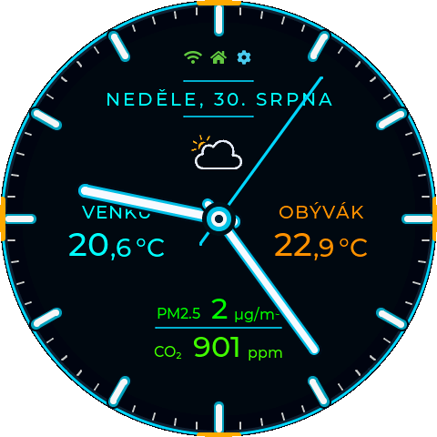
</p>

<p align="center">
  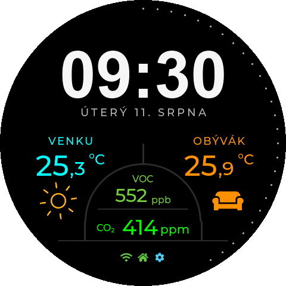
  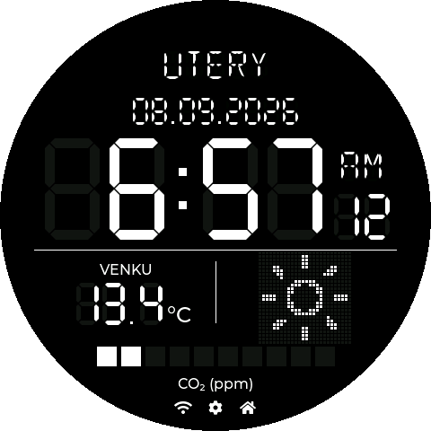
</p>

<p align="center">
  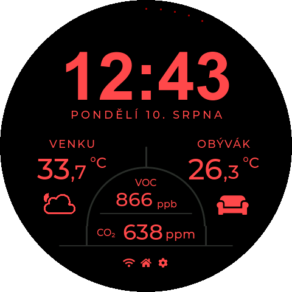
  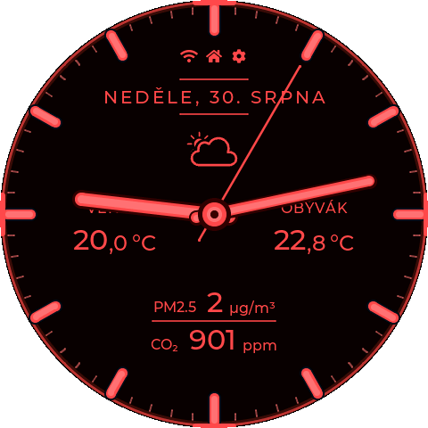
  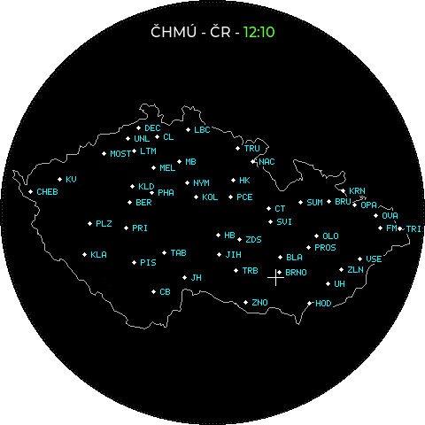
</p>

V denním režimu mají jednotlivé hodnoty vlastní barvy. Volitelný červený
noční vzhled sjednotí dashboard i meteoradar do odstínů červené a sníží jas,
aby displej v noci nerušil. Vedle klasického digitálního rozložení lze zvolit
také analogový ciferník s vlastním barevným tónem a volitelnými akcenty na
pozicích 12, 3, 6 a 9 hodin.

## Co firmware umí

- digitální hodiny s fonty Barlow, Liberation Sans, LCD DSEG nebo Doto, nebo
  analogový ciferník s nastavitelným tónem a volitelnými hlavními akcenty,
- Retro LCD se segmentovým časem, dvěma hodnotami A/B, pevnými pozicemi
  číslic a nastavitelnou barvou pozadí i popředí,
- české nebo anglické datum v několika formátech a volitelný vteřinový prstenec,
- synchronizaci času přes NTP a časové pásmo podle polohy včetně automatických přechodů letního času,
- dvě univerzální horní hodnoty s vlastním názvem, jednotkou, přesností,
  ikonou a plynulou barevnou škálou,
- animované i statické ikony počasí založené na Meteocons,
- teplota uprostřed předpovědi má samostatný zdroj: volitelné HA teplotní
  čidlo v sekci Počasí → Předpověď, jinak teplota HA weather, následně
  aktuální Open-Meteo podle polohy; ostatní zobrazované hodnoty se nepoužívají,
- samostatná stránka předpovědi Open-Meteo: následujících 12 celých hodin,
  teploty, větší denní/noční ikony se stínem a plynulý teplotní přechod po obvodu
  s vyplněným středem podle aktuální teploty a radiální čárou od jeho okraje, která odděluje začátek a konec předpovědi;
  vodorovně mezi hodinami a radarem, s aktuálním počasím uprostřed;
  dostupná také při použití Home Assistantu; automatické střídání má samostatné
  délky pro hodiny, předpověď a radar (0 = vynechat, všechny 0 = bez přepínání),
- volbu zdroje meteoradaru MAX Z (původní, výchozí) nebo MAX Z s maskou; maska zesvětluje oblasti, kde srážky pravděpodobně nedopadají na zem,
- srážkový radar ČHMÚ/SHMÚ s mapou ČR nebo Slovenska, městy a 1 až 15 snímky (SK nejvýše 10),
- rozsahy 25, 50, 100 a 200 km nebo celý stát ovládané svislým gestem swipe,
- červenou noční paletu radaru se zachováním rozlišení intenzity srážek,
- volitelné automatické střídání hodin, předpovědi a radaru se samostatnou dobou zobrazení,
- dvě další měřené veličiny, například CO₂, VOC, vlhkost, tlak nebo baterii,
- vlastní čidla TMEP.cz jako volitelný doplněk hodnot Open-Meteo,
- vlastní jednotky, počet desetinných míst a plynulé barevné škály,
- denní a noční jas s ručním přepínáním nebo automatikou podle Open-Meteo či entity slunce,
- tři efekty vteřin: klasické tečky, plynulou čáru a kometu,
- webovou konfiguraci s volitelným heslem, export a import zálohy a bezpečný restart,
- samostatnou živou diagnostiku hardwaru, paměti, sítě, Home Assistantu a radaru,
- prvotní nastavení Wi-Fi přes Improv Serial,
- A/B OTA aktualizace se zachováním Wi-Fi a konfigurace,
- ovládací API pro Home Assistant chráněné náhodným secretem,
- notifikace přes API s nadpisem, víceřádkovou zprávou, barvami, časovým limitem
  nebo zavřením klepnutím a volitelným pípnutím,
- základní nastavení také přímo na dotykovém displeji.

## Potřebný hardware

Firmware je určený výhradně pro **Waveshare ESP32-S3-Touch-LCD-2.1** s
480 × 480 px displejem a 16MiB flash. Konfigurace pinů, displeje ST7701,
dotyku CST820, PSRAM a partition table odpovídá této konkrétní desce.

Desku můžete zakoupit u českých prodejců:

<p align="center">
  <a href="https://pajenicko.cz/waveshare-esp32-s3-touch-lcd-2.1-s-kulatym-ips-lcd-dotykovym-displejem"></a>&nbsp;&nbsp;&nbsp;&nbsp;
  <a href="https://www.laskakit.cz/waveshare-esp32-s3-round-2-1--480--480-ips-touch-wifi-modul/"></a>
</p>

Nepoužívejte tento binární obraz na jiném modelu jen proto, že také obsahuje
ESP32-S3. Odlišný pinout nebo flash layout může zabránit startu zařízení.

## Instalace pro běžného uživatele

### Instalace z prohlížeče

Veřejná [instalační stránka na GitHub Pages](https://coolajz.github.io/waveshare-hodiny/)
umožňuje nahrát stabilní release přímo z desktopového Chromu nebo Edge přes
USB. Instalační tlačítko se zpřístupní, jakmile je na GitHubu dostupný veřejný
stabilní release se zkontrolovaným čtyřdílným factory balíčkem.

Do té doby lze použít release balíček s manifestem v
[ESP Web Tools](https://web.esphome.io/) nebo firmware sestavit ze zdrojů
podle kapitoly [Sestavení ze zdrojů](#sestavení-ze-zdrojů). Factory instalace
vyžaduje všechny části a přesné offsety uvedené v release `manifest.json`;
samostatný aplikační `.ota.bin` není factory obraz.

### Nastavení Wi-Fi

Veřejný release neobsahuje přednastavené Wi-Fi údaje. Síť lze při instalaci
nastavit přes Improv Serial z kteréhokoliv USB-C konektoru. Pokud se tento krok
přeskočí nebo se uloženou síť nepodaří při startu připojit, hodiny zobrazí QR
kód a spustí vlastní zabezpečenou Wi-Fi s captive portálem. V telefonu stačí
QR kód naskenovat, vybrat nalezenou 2,4GHz síť a zadat její heslo.

Nové údaje se nejprve uloží jako čekající a hodiny se restartují. Teprve po
úspěšném připojení při dalším startu nahradí poslední ověřenou Wi-Fi. Při
neúspěchu se znovu otevře onboarding a původní funkční údaje zůstanou
zachované.

Deska má USB–UART konektor přes CH343P a nativní USB konektor ESP32-S3.
Produkční firmware obsluhuje Improv Serial na obou konektorech.

## První spuštění

1. Nainstalujte firmware a nastavte Wi-Fi přes Improv Serial, nebo tento krok
   přeskočte a použijte QR onboarding přímo na displeji hodin.
2. Počkejte na připojení; na displeji se zobrazí IP adresa a stavové ikony.
3. Otevřete `http://waveshare-hodiny.local/`. Pokud mDNS v síti nefunguje,
   použijte IP adresu z nastavení na displeji.
4. V záložce **Zdroj a poloha** vyberte Open-Meteo s TMEP.cz nebo Home Assistant
   a vyhledejte město. Poloha určuje časové pásmo hodin, místo pro počasí Open-Meteo i střed meteoradaru. Platí také při použití Home Assistantu.
5. Při použití Home Assistantu zadejte jeho adresu a long-lived access token a
   tlačítkem **Otestovat připojení** ověřte spojení.
6. Upravte vzhled, radar a jas a zvolte **Uložit změny**.

Nová konfigurace používá Open-Meteo, polohu Brno a pohled meteoradaru na celou
Českou republiku. Home Assistant není pro základní provoz povinný.

## Zdroje dat

### Open-Meteo

Open-Meteo je výchozí zdroj a nevyžaduje účet ani token. Poskytuje aktuální
počasí a čtyři konfigurovatelné hodnoty. Vybrané město a jeho GPS souřadnice
současně určují střed lokálních pohledů meteoradaru. U každé ze čtyř
pozic lze samostatně nastavit 0 až 2 desetinná místa; stejné nastavení platí
i při výběru hodnoty TMEP.cz.

### Časové pásmo podle polohy

Při vyhledání města se z Open-Meteo převezme jeho časové pásmo a uloží se
společně s polohou. Jazyk rozhraní na časové pásmo nemá vliv. Letní čas se
přepíná automaticky podle pravidel dané oblasti; ruční přepínač není potřeba.
Hodiny, čas snímků radaru a denní kontrola aktualizací používají stejné pásmo.
NTP nadále synchronizuje skutečný čas v UTC.

Při aktualizaci starší konfigurace nebo importu starší zálohy se chybějící
pásmo dohledá podle uložených souřadnic, i když je zdrojem dat Home Assistant.
Do úspěšného dohledání zůstává původní české pásmo a automatická kontrola
aktualizací čeká. Nová konfigurace začíná s Brnem a pásmem `Europe/Prague`.

Po synchronizaci běží čas i během výpadku Wi-Fi a uložená pravidla zajistí
přechody bez internetu. Po restartu je pro získání přesného času potřeba NTP.
Vestavěná data IANA 2026c pokrývají roky 2020–2100 včetně nepravidelných
přechodů; pozdější legislativní změny vyžadují aktualizaci databáze ve firmwaru.
Generátor a zdroj databáze jsou popsané v `tools/generate_timezones.py`.

### TMEP.cz jako doplněk Open-Meteo

K režimu Open-Meteo lze přidat vlastní čidla z TMEP.cz. Vložte celou URL ze sekce
**Rozšířený JSON – se všemi čidly**, zvolte **Ověřit a načíst čidla** a hodnoty až
32 čidel se přidají přímo do stejných čtyř výběrů pod skupinu TMEP.cz. Firmware
používá jednotku vrácenou exportem, takže podporuje i vlastní veličiny.

Je-li vybraná alespoň jedna hodnota TMEP, celý export se načítá jedním HTTPS
požadavkem každou minutu. Bez vybrané hodnoty se katalog načte jednou po startu
a dál se pravidelně neobnovuje. Otevření webové konfigurace nejprve zobrazí
uložený katalog a nejvýše jednou za načtení stránky jej aktualizuje přímo
z TMEP.cz. Open-Meteo se nezávisle obnovuje jednou za 10 minut.

Firmware si z vložené URL bezpečně vybere ID a exportní klíč a požadavek vždy
skládá s `extended=1&all=1`. Citlivé údaje zůstávají uložené v zařízení a API
ani běžný konfigurační JSON je nevracejí. Kompletní šifrovaná záloha je obsahuje. Volbou **Odebrat TMEP.cz** se smaže URL, katalog,
diagnostický stav i přiřazení TMEP; dotčené pozice se vrátí na výchozí hodnoty
Open-Meteo.

Příklad exportní URL:
`https://tmep.cz/vystup-json.php?id=11746&export_key=XXXXXXXXsd&extended=1&all=1`

### Home Assistant

Firmware čte jednotlivé entity přes REST API Home Assistantu. Nepotřebuje
MQTT, vlastní integraci ani administrátorský účet.

### Vytvoření tokenu

V Home Assistantu otevřete svůj uživatelský profil, sekci **Long-lived access
tokens**, vytvořte nový token pro hodiny a vložte jej do webové konfigurace.
Použijte účet pouze s oprávněními, která zařízení skutečně potřebuje.

Token se po uložení už do webové stránky neposílá a nelze jej z ní přečíst;
lze jej pouze nahradit. Při testu se uložený token znovu použije jen pro přesně
stejnou uloženou adresu Home Assistantu. Pokud adresu změníte, musíte zadat také
nový token.

Firmware podporuje lokální HTTP i HTTPS servery s vlastním nebo neplatným
certifikátem. U HTTPS spojení s Home Assistantem proto v současnosti neověřuje
certifikát serveru. Tato volba usnadňuje domácí instalace, ale nechrání token
před aktivním útočníkem v síti. Používejte firmware pouze v důvěryhodné LAN.

### Doporučené entity

| Údaj | Příklad entity | Poznámka |
| --- | --- | --- |
| Počasí | `weather.domov` | Textový stav HA nebo podporovaný číselný kód |
| Slunce | `sun.sun` | Řídí automatický denní/noční režim |
| Hodnota vlevo | `sensor.venkovni_teplota` | Teplota, CO₂, PM, tlak nebo jiný číselný senzor |
| Hodnota vpravo | `sensor.obyvak_co2` | Teplota, CO₂, PM, tlak nebo jiný číselný senzor |
| Hodnota A/B | `sensor.obyvak_co2` | CO₂, VOC, PM, vlhkost, tlak a další |

ID entit se zadávají ručně. Nedostupná nebo neplatná hodnota se na displeji
zobrazí jako `--`.

## Webová konfigurace

<p align="center">
  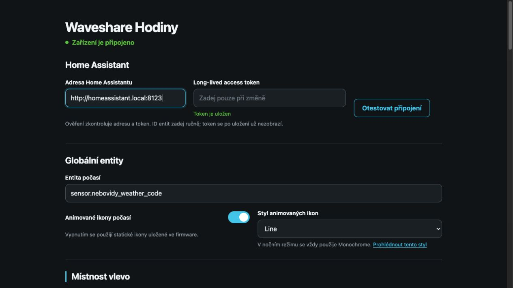
</p>

Web umožňuje nastavit:

- jazyk zařízení; dokud není uložená volba, displej používá češtinu a při
  prvním otevření webu se uloží čeština pro prohlížeče `cs`/`sk`, jinak
  angličtina; další návštěvy už respektují uložené nastavení zařízení a jazyk
  lze kdykoli přepnout vlajkami v pevném horním pruhu webu,
- zdroj dat Open-Meteo nebo Home Assistant a společnou polohu zařízení,
- Home Assistant URL, token, entitu počasí a entitu slunce,
- přednostní HA čidlo pro aktuální teplotu uprostřed předpovědi,
- levou a pravou horní hodnotu včetně typu, názvu, jednotky, přesnosti, ikony
  a barevné škály,
- styl animovaných ikon `Monochrome`, `Flat` nebo `Line`,
- meteoradar ČHMÚ/SHMÚ s obrysem ČR nebo SK, městy a pohledy 25, 50, 100, 200 km nebo celý stát,
- měřené hodnoty A a B, jednotky, přesnost a barevné škály,
- barvu hodin, data a obou částí vteřinového efektu,
- denní/noční jas, ruční nebo automatický režim a automatické střídání tří stránek,
- automatické OTA aktualizace a režim webového serveru,
- volitelné heslo webového nastavení,
- export/import zálohy, restart, ovládání podsvícení a živou diagnostiku.

### Vzhled ciferníků

Digitální a Retro LCD ciferník podporují společnou volbu 24/12 hodin s AM/PM,
nezávislou na jazyku; výchozí je 24 hodin. Volba úvodní nuly je také společná;
LCD při jejím vypnutí zachovává podkres první číslice.

Retro LCD nabízí přepínač **Pevné pozice dne** (výchozí vypnuto): sedm pozic
v češtině a devět v angličtině, s pohaslými znaky kolem kratších názvů.
Vypnutí vrací přesně centrovaný název bez okolních pozic.

Formát data LCD lze vybrat samostatně: pořadí den–měsíc–rok, měsíc–den–rok
nebo rok–měsíc–den, s tečkami, pomlčkami či lomítky podle varianty. Každý
formát má variantu bez úvodních nul, která zachová prázdné pozice a podkres.
Výchozí je DD.MM.YYYY.

V nastavení analogového ciferníku lze nezávisle zapnout **Tónované výplně ciferníku**
a **Tónované výplně ručiček**. Světlé výplně značek a plných ručiček pak používají
zesvětlený tón příslušné zvolené barvy. Oba přepínače jsou výchozí vypnuté a zachovávají původní bílé výplně;
obrysové ručičky a červený noční režim se nemění. Náhled platí do restartu,
trvale se uloží tlačítkem **Uložit**.

### Vlastní obrázek na pozadí (vývojová verze)

V záložce **Displej → Obrázek na pozadí** lze nahrát JPG, PNG nebo WebP
(do 20 MB), posunout jej a přiblížit v kruhovém náhledu. Prohlížeč připraví
přesný výřez 480 × 480. Editor zobrazuje pouze obrázek v plné viditelnosti,
bez ciferníku a stínů. Viditelnost a stíny se prohlížejí přímo na hodinách.
**Nahrát pozadí do hodin** samostatně uloží obrázek a jeho nastavení přímo do hodin.
Běžné **Uložit nastavení** ukládá také viditelnost a stíny pozadí, bez nahrávání nového výřezu.
Posuvníky upravují viditelnost fotografie a sílu stínu textů, ikon a ručiček;
Vzdálenost stínu nastavuje odsazení 0–5 px (výchozí 2 px).
Mohutnost stínu rozšiřuje jeho obrys o 0–5 px do všech stran, nezávisle na síle a vzdálenosti.
0 % stínu jej vypne. Po puštění posuvníku (nebo přepnutí pozadí) se náhled
projeví přímo na hodinách bez zápisu a zhasnutí, s již nahraným obrázkem.
Náhled platí do restartu; trvale jej potvrdí **Nahrát pozadí do hodin**. Nový výřez
vyžaduje nahrání. Kruhová maska pozadí platí i při posouvání obrazovek.
Obrázek je společný pro analogový a digitální ciferník.
Načtený obrázek a připravené cache zůstávají při běžném přepínání v PSRAM,
aby návrat na ciferník nevyžadoval nové čtení z flash. Vypnutí pozadí jeho
obrázek uvolní; při nedostatku paměti pro radar se uvolní neaktivní cache. Cache stínů má limit 64 KiB,
statický analogový ciferník 128 KiB. Nahrávání zapisuje po malých blocích
do flash bez druhé kopie obrázku v PSRAM. Hlavní uložení potvrzuje nastavení
ciferníku a pozadí společně; opakované uložení stejného pozadí nevyvolá zápis.

Volba **Pouze hodiny**, dostupná pouze u analogu v nastavení pozadí, skryje ikony, datum, dělicí čáry a všechny hodnoty. Sběr dat pokračuje; skryté animace počasí jsou pozastavené. Vypnutí pozadí vrátí běžné zobrazení. Volba je součástí nastavení i zálohy.

Barvu podkladu analogu lze změnit ve **Vzhledu hodin → Barva podkladu**. Použije se bez obrázku; výchozí `#000A14` zachovává původní namodralý vzhled. Červený noční režim si ponechává svůj podklad.

V červeném nočním režimu se obrázek automaticky skryje a po jeho skončení
se obnoví. Přepínač **Použít pozadí** umožňuje obrázek skrýt bez smazání.
Obrázek přežije restart a spolu s nastavením pozadí je součástí šifrované
zálohy, i když je pozadí vypnuté. Obnovuje se hotový výřez uložený v hodinách. Nahrávání zachová původní obrázek do ověření nového souboru. Po dobu přenosu
a zápisu displej zhasne a usne. Po dokončení nebo zrušení přenosu se probudí,
překreslí oba obrazové buffery a obnoví synchronizaci; teprve potom se rozsvítí.

Ve **Vzhledu hodin** má digitální ciferník vlastní **Barvu oblouku a čar**
s náhledem na displeji. Jeho oblouk a oddělovací čáry používají společnou sílu
stínů pozadí; 0 % je vypne. Barva se ukládá s nastavením vzhledu.

Přepínač vedle nadpisu pozadí změnu rovnou uloží. Při vypnutí skryje editor.
Nahrávání probíhá v dialogu s procenty a upozorněním na dočasně černý displej.

### Hodinová předpověď počasí

Předpověď je samostatná obrazovka, nikoli čtvrtý ciferník. Vodorovným swipem
listujete **Hodiny → Předpověď → Meteoradar → Hodiny**, opačným směrem zpět.
Mimo ČR a Slovensko se radar vynechá a přepínáte mezi hodinami a předpovědí.

Po obvodu je následujících **12 celých hodin** s teplotou a denní/noční ikonou
počasí. Barevný vějíř plynule znázorňuje očekávané teploty, radiální čára
odděluje začátek a konec časového rozsahu. Uprostřed je aktuální počasí a teplota.
Časy používají uložené časové pásmo polohy. V červeném nočním režimu se vzhled
přizpůsobí noční paletě.

Hodinová data vždy pocházejí z Open-Meteo pro uloženou polohu — i když jsou
ostatní hodnoty hodin z Home Assistantu. Nevyžadují účet ani API token.
Při úspěšném načtení se obnovují přibližně po 10 minutách, při chybě se další
pokus plánuje po minutě. Chybějící hodinová hodnota se nezobrazuje jako 0 °C.

Aktuální teplota uprostřed má vlastní pořadí zdrojů:

1. Volitelné teplotní čidlo HA z **Počasí → Předpověď → Přednostní entita teploty z HA**.
2. Teplota aktivní entity HA weather.
3. Aktuální teplota Open-Meteo pro vybranou polohu.

HA zdroje se použijí jen při aktivním a nakonfigurovaném Home Assistantu.
Čidlo může používat °C, °F nebo K; firmware teplotu převede na °C. Při
`unknown`, `unavailable` nebo nepodporované jednotce pokračuje dalším zdrojem.
Tato volba nemění ikonu počasí ani hodinovou předpověď a nepřebírá hodnotu
z horních polí nebo metrik A/B.

### Automatické střídání obrazovek

Ve webu zapněte **Automaticky střídat obrazovky** a nastavte dobu pro každou stránku
v rozsahu 0–3600 sekund. Výchozí časy jsou hodiny 120 s, předpověď 20 s a radar
20 s; samotné střídání je po čisté instalaci vypnuté. **0 vynechá danou stránku**,
všechny tři nuly nechají aktuální stránku beze změny. Ruční swipe funguje i pro
stránku vynechanou automatickým střídáním.

Střídání čeká na Wi-Fi a synchronizovaný čas a pozastaví se v nastavení,
při vypnutém displeji nebo aktivní notifikaci. Nedostupný či nepřipravený radar
se dočasně přeskočí, aniž by zastavil střídání hodin a předpovědi. Mimo ČR a Slovensko se
střídají pouze hodiny a předpověď. Radar svůj rozběhnutý animační cyklus před
přechodem dokončí, takže jeho nastavená doba je minimum.

### Meteoradar ČHMÚ a SHMÚ

Podle země uložené polohy se automaticky vybírá mapa a zdroj: `CZ` používá
otevřený kompozit MAX_Z ČHMÚ (včetně stávající volby maskované varianty), `SK`
používá SHMÚ ZMAX. Pro zpracování a načítání slovenských radarových dat
hodiny využívají pomocný server.
Mapy obou zemí obsahují hranice a města, pohledy 25, 50, 100 a 200 km kolem
uložené GPS polohy a přehled celého státu. Ovládání, průhlednost mapy,
noční režim a automatické střídání jsou společné.

Slovenský radar podporuje nejvýše 10 snímků. Nastavení 11–15 proto pro SK
použije 10, česká preference se zachová. Šedé šrafování
znamená chybějící měření, nikoli nulové srážky. Seznam s nejnovějším měřením
starším než 30 minut se odmítne; při výpadku zůstane poslední připravená
animace s původními časy a chybovým stavem v diagnostice.

**Po aktualizaci přidávající slovenský radar je u dříve uložené slovenské
polohy potřeba ve webovém nastavení znovu vyhledat, vybrat a uložit město.**
Tím se uloží kód země `SK` a zpřístupní slovenský meteoradar. Stačí to provést
jednou; další aktualizace opakovaný výběr nevyžadují. Pro jiné země se radar nespouští ani nestahuje na pozadí.
Počasí Open-Meteo a Home Assistant toto omezení nemají.

Slovenská radarová data: SHMÚ, [CC BY 4.0](https://opendata.shmu.sk/README.txt).
Zdrojové snímky se uchovávají v PSRAM,
takže běžná změna rozsahu nevyžaduje nové stažení. SK zdrojová cache má rozpočet
1 MiB a ponechává rezervu volné paměti. Při mimořádně velkých souborech se mohou
uvolnit starší zdroje; připravené snímky animace zůstávají zachované. Změna rozsahu
pak může vyžadovat doplnění uvolněných zdrojů. Aktualizace ve stejném výřezu
stahuje pouze chybějící snímky i po delší pauze. Mapa a města se kreslí v hodinách. Slovenské snímky používají indexovanou
paletu RGB565 podle legendy SHMÚ, stále s jedním bajtem na pixel. Poloha
měst a vzorkování rastru používají společný výpočet středů pixelů.
Hranice: Natural Earth (public domain),
města: [GeoNames](https://www.geonames.org/) (CC BY 4.0).

Počet snímků lze nastavit od 1 do 15. Jeden snímek znamená statický radar;
vyšší počet vytvoří animaci od nejstaršího snímku k nejnovějšímu. Po posledním
snímku následuje nastavitelná pauza 0 až 30 sekund; výchozí hodnota je 5 sekund.
Čas posledního, tedy nejaktuálnějšího snímku je v denním režimu zvýrazněný
jasně zeleně. Decentní pruh pod popisem ukazuje průběh animace a během kompletní
přípravy prázdné cache je červený. Nová data se kontrolují v pevných
pětiminutových slotech přibližně minutu po čase publikace ČHMÚ.

Při červeném nočním vzhledu se mapový podklad, města, poloha, čas i jednotlivé
stupně odrazivosti převedou do odstínů červené. Jas jednotlivých stupňů dál
vyjadřuje intenzitu srážek a nejslabší odrazy mají zachované čitelné minimum.
Čas nejaktuálnějšího snímku má stejnou červenou jako ostatní text. Převod
probíhá z připravené cache, takže přepnutí vzhledu nevyvolá nové stahování ani
přípravu animace.

Tlačítka rozsahů na webu mění právě zobrazený pohled okamžitě. Modrá označuje
aktuální rozsah na hodinách a žlutá uložený výchozí rozsah. Do trvalé
konfigurace se změna zapíše až tlačítkem **Uložit změny**. Rozsah zvolený
dotykem na displeji zůstává pouze do restartu; po něm se obnoví hodnota
naposledy uložená přes web.

Automatické střídání hodin, předpovědi a radaru je ve výchozím stavu vypnuté.
Každá stránka má samostatnou dobu zobrazení. Nastavený čas radaru
je minimální: rozběhnutý animační cyklus se vždy dokončí včetně závěrečné
pauzy, takže přechod na další stránku nepřeruší animaci uprostřed. Po restartu
se příprava cache spustí na pozadí až po připojení Wi-Fi a synchronizaci času.
Automatické střídání radar zařadí až po přípravě kompletní animace; další přechody
ji proto zobrazí okamžitě od nejstaršího snímku. Je-li automatické střídání
vypnuté, firmware radar na pozadí nestahuje a načítání začne až při ručním
otevření.

### Barevné prahy měřených hodnot

Každá měřená hodnota může mít až deset dvojic **hodnota → barva**. Firmware
mezi sousedními body plynule interpoluje, takže změna barvy na displeji není
omezena jen na několik tvrdých stavů. Škály jsou nezávislé: například VOC může
používat jiné hranice než CO₂.

<p align="center">
  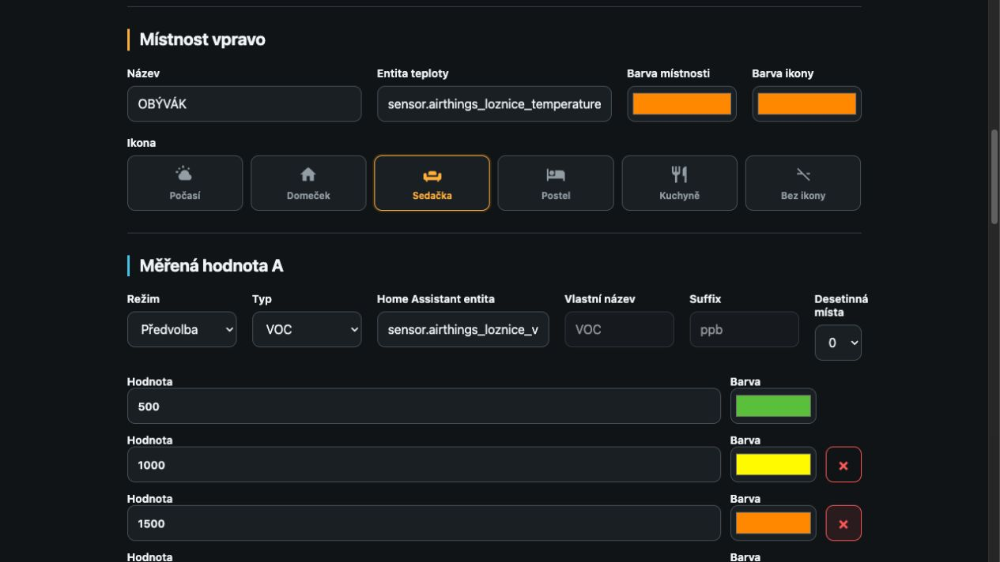
  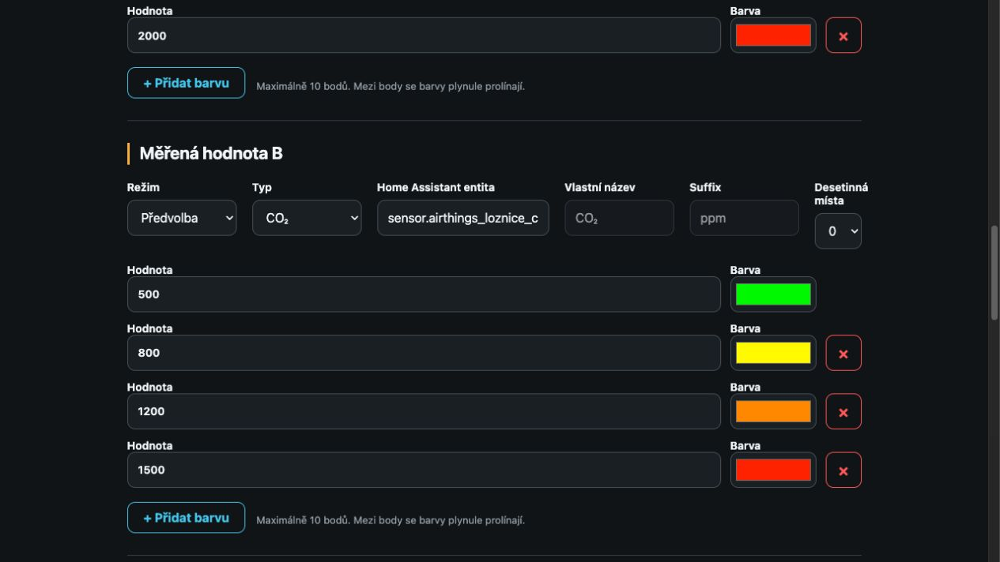
</p>

### Jas, denní/noční režim a vteřiny

Denní i noční jas se nastavují samostatně. Automatika používá východ a západ
slunce s volitelným ranním a večerním offsetem. Volitelná entita světla může v
nočním čase dočasně aktivovat denní vzhled. Volba **Vzhled nočního režimu** je
dostupná i při vypnuté automatice, protože stejný červený vzhled lze zapnout
ručně krátkým dotykem na hodinách i meteoradaru. Samostatně lze nastavit také
barvu hodin, data, typ vteřinového efektu, velikost a jas jeho aktivní i
neaktivní části.

<p align="center">
  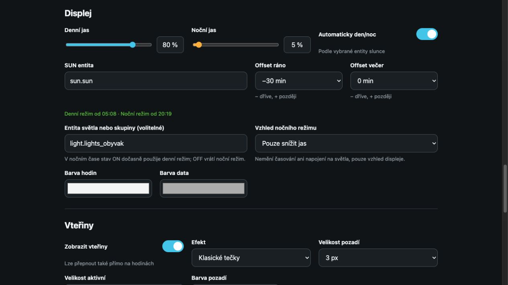
</p>

Konfigurační web je ve výchozím režimu **Vždy zapnutý**. Lze jej přepnout na
deset minut po startu nebo aktivaci z displeje, případně jej úplně vypnout.
Provozujte jej jen v důvěryhodné síti; aktivní web signalizuje ikona ozubeného
kola na dashboardu.

Webové nastavení lze chránit heslem o délce 6 až 20 znaků. Stav bez hesla je
v záložce **Systém** označený červeně, aktivní ochrana zeleně. Heslo je uložené
v zařízení jako odvozený hash, nelze je zpětně zobrazit a je součástí pouze
šifrované kompletní zálohy.

### Diagnostika

V záložce **Systém** je odkaz na samostatnou stránku `/diagnostics`, která se
otevře v novém panelu. Bez dalších měření na pozadí zobrazuje aktuální a
minimální volnou interní RAM a PSRAM, procesor, velikost flash, důvod restartu,
Wi-Fi, IP adresu a skutečnou frekvenci pixel clocku displeje. Dále ukazuje stav
Home Assistantu, Open-Meteo a TMEP.cz a u radaru vybrané město, GPS, rozsah, počet
připravených snímků, jejich časové rozpětí, poslední úspěšnou aktualizaci,
další plánovanou kontrolu, HTTP stav a právě zpracovávaný soubor.

### Záloha konfigurace

Kompletní záloha se stahuje jako soubor `.whbackup`; název obsahuje verzi FW
a datum i čas exportu. Při exportu zadejte
heslo a jeho potvrzení (alespoň 8 znaků, nejvýše 128 znaků / 256 UTF-8 bajtů).
Firmware šifruje uložené nastavení pomocí AES-256-GCM; heslo se v hodinách
trvale neukládá. Neuložené změny a dočasné náhledy nejsou součástí exportu.

Záloha obsahuje nastavení hodin a vzhledu, HA URL a token, TMEP přístupové
údaje, ověřovací záznam hesla webu, secret ovládacího API a uložený obrázek
s nastavením pozadí (i při vypnutém pozadí). Přenos obrázku má průběh v procentech;
při jeho obnově se displej dočasně vypne a po dokončení znovu zapne. **Wi-Fi není
součástí zálohy a při obnově se nemění.** Bez hesla zálohu nelze obnovit.
Přenos hesla do hodin zůstává přes místní HTTP, stejně jako zadávání tokenu;
šifrování chrání soubor, ne tento síťový přenos.

Import nabízí výběr souboru i přetažení. Před zadáním hesla zobrazí čitelnou
hlavičku s verzí zdrojového FW, schématem a časem vytvoření (pokud byly hodiny
synchronizované). Hlavička je ověřována spolu s šifrovaným obsahem. Novější FW
ve hlavičce je upozornění; rozhodující je podporované schéma. Podporované
starší konfigurace se migrují v paměti, neznámé schéma se odmítne bez zápisu.

Po ověření hesla, neporušenosti a celého nastavení se zapíše neaktivní kopie
konfigurace, přečte se zpět a teprve potom se atomicky aktivuje. Součástí
stejné změny je trvalé potvrzení operace. Po restartu web ověří toto potvrzení;
při ztrátě spojení nezobrazuje neověřený úspěch a neopakuje import. Pokud
obnovené nastavení vypíná web, lze potvrzení přesto ověřit a web znovu povolit
na displeji. Obnovuje se i ochrana webu, takže další otevření nastavení může
vyžadovat původní heslo webu ze zálohy.

Starší nešifrované JSON zálohy formátu 2 lze nadále importovat jako omezenou
obnovu nastavení bez přístupových údajů. Heslo zálohy se u nich nevyžaduje.
HA token se zachová pouze při shodné URL; chybějící přístup TMEP neblokuje
uložení vybraných pozic. Chybějící přístupové údaje následně doplňte ručně.

Při návratu k firmware, který nové úložiště ještě nezná, jsou dostupná pouze
původní nastavení z doby před přechodem. Pozdější změny se do staršího firmware
automaticky nepřenesou; před downgrade si ponechte odpovídající zálohu.

Podrobnosti formátu, transakcí a migračních testů jsou v
[docs/configuration-backup.md](docs/configuration-backup.md).

## Budíky

Záložka **Budík** umožňuje uložit až 12 opakovaných budíků. Každý má čas,
výběr dnů pondělí–neděle a vlastní vypínač; společný vypínač pozastaví všechny
budíky bez smazání a ukládá se ihned malým samostatným zápisem. Změny časů,
dnů a jednotlivých budíků potvrďte tlačítkem **Uložit**.
Časy se řídí časovým pásmem nastaveným v hodinách.

První stránka nastavení na displeji zobrazuje nejbližší termín, společné
zapnutí/vypnutí a **Přeskočit další**. Přeskočení platí pouze pro nejbližší
termín (včetně více budíků ve stejný čas); tlačítkem **Zrušit přeskočení** ho
lze vrátit. Tyto dvě akce se ukládají ihned a přežijí restart. Upravení seznamu
budíků na webu ruší případné přeskočení. Aktivní budíky označuje ikonka zvonku
u stavových ikon digitálních, analogových a Retro LCD hodin. Přeskočený termín
označuje přeškrtnutý zvonek, který se po dosažení termínu automaticky vrátí
na běžnou ikonu.

Zvonění začíná dvěma krátkými pulzy, přibližně po 17 sekundách přejde na čtyři
a po 47 sekundách se skupiny zrychlí. Před změnou rytmu doběhne celý cyklus
a přidá se 0,6 sekundy ticha. Ťuknutím na displej zvonění zastavíte; další
opakování zůstane nastavené. Bez zásahu se zvonění vypne po 10 minutách.
Vypnutý displej se při začátku zvonění probudí. Při zvonění je zobrazený
ciferník místo samostatné obrazovky budíku; hodiny na něj přejdou i z předpovědi,
radaru či nastavení. Během zvonění nelze budík
překrýt webovou notifikací. Zastavení funguje nad všemi obrazovkami a dotyk
nepřepne denní/noční režim. Během zvonění se automatické střídání pozastaví.

Budík vyžaduje platný čas zařízení. Po výpadku napájení se nezvoní zpětně za
uplynulé minuty. Při jarní změně času se neexistující čas vynechá; při podzimní
změně zazvoní opakovaná minuta nejvýše jednou. Nastavení i informace o již
spuštěném termínu jsou součástí šifrované zálohy. Stávající konfigurace se
migruje na schéma 33 bez ztráty nastavení a s prázdným seznamem budíků.

## Nastavení na displeji

Nastavení otevře dlouhý stisk na hodinách, předpovědi i meteoradaru.
Vodorovné gesto listuje mezi třemi stránkami; opačný směr prochází zpět.
Mimo ČR a Slovensko jsou dostupné pouze hodiny a předpověď.

Na hodinách swipe nahoru cyklí ciferníky Digitální → Analogový → Retro LCD,
swipe dolů prochází opačným směrem. Přepnutí je dočasné; po restartu se vrátí
uložený ciferník. Pokud jsou povolené animované přechody, ciferníky se posouvají
svisle ve směru tahu během 500 ms, jinak se přepnou okamžitě.

Na radaru swipe nahoru pohled přiblíží a swipe dolů jej oddálí. Změna provedená
na displeji je dočasná a nezapisuje se do flash.

| Obrazovka a gesto | Výsledek |
| --- | --- |
| Kterákoli hlavní stránka: vodorovný swipe | Další / předchozí stránka: hodiny, předpověď, meteoradar |
| Hodiny: swipe nahoru / dolů | Další / předchozí ciferník |
| Předpověď: swipe nahoru / dolů | Nemění ciferník ani rozsah |
| Kterákoli hlavní stránka: dlouhý stisk | Otevře nastavení |
| Kterákoli hlavní stránka: krátký dotyk při vypnuté automatice den/noc | Přepne denní a noční režim |
| Aktivní notifikace: krátké klepnutí | Zavře zprávu a odkryje původní stránku |
| Meteoradar: swipe nahoru | Přiblíží rozsah |
| Meteoradar: swipe dolů | Oddálí rozsah |

Nastavení má pět stránek: Budík, typ hodin, jas, ikony a vteřiny, web a OTA. Velká tlačítka se šipkami je přepínají; gesto swipe
se nepoužívá.

<p align="center">
  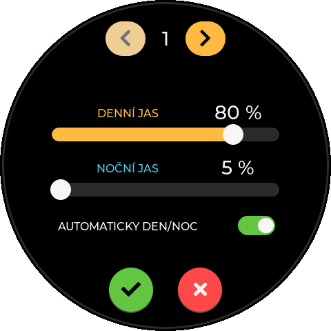
  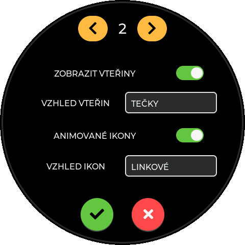
  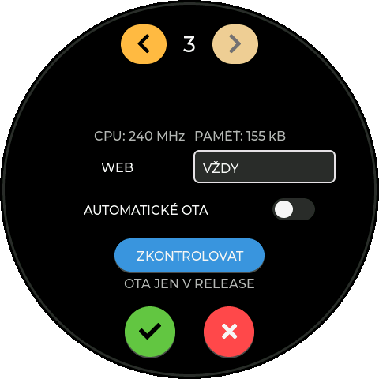
</p>

První stránka ovládá budíky, druhá typ hodin a třetí denní a noční jas
a automatický režim. Čtvrtá přepíná vteřiny a animované ikony. Pátá řídí
režim webového serveru a ruční kontrolu OTA. IP adresa je na veřejném snímku záměrně skrytá. Krátký
dotyk hodin i meteoradaru při vypnuté automatice přepíná denní a noční režim.

## Animované Meteocons

Statické monochromatické ikony jsou uložené přímo ve firmware. Volitelné
animované ikony veřejného buildu se stahují z GitHub Pages a ukládají do
lokální cache. V nočním režimu se vždy použije monochromatický styl, aby ikony
respektovaly červené noční zobrazení.

V `docs/assets/weather-icons/` je pouze 45 GIFů používaných firmwarovým
allowlistem: 15 stavů pro každý ze stylů Monochrome, Flat a Line. Každý veřejný
manifest obsahuje skutečnou velikost a SHA-256 souboru; kompletní pracovní
mirror 1557 ikon v repozitáři není. Postup reprodukovatelného vytvoření je v
[`METEOCONS_ASSET_PIPELINE.md`](METEOCONS_ASSET_PIPELINE.md).

## OTA aktualizace

Release firmware používá A/B layout se dvěma stejně velkými 6MiB aplikačními
oddíly. Veřejný build čte statická metadata a OTA obraz pouze z GitHub Pages;
interní vývojový profil může dál používat Firmware Hub. Nová aplikace se
zapisuje do neaktivního slotu. Před aktivací se ověří:

- HTTPS spojení a povolený release origin,
- HTTP status a deklarovaná velikost,
- skutečný počet přijatých bajtů,
- SHA-256 obrazu,
- rodina čipu ESP32-S3,
- kapacita neaktivního aplikačního oddílu.

Při chybě zůstane aktivní stávající firmware. Wi-Fi a konfigurace v NVS a
`clockcfg` se při běžné OTA aktualizaci zachovají. Factory instalace nebo
vymazání celé flash je jiná operace a může uživatelská data odstranit.

Verze 1.6.0 podporuje jedinou historickou migraci konfigurace z veřejné verze
1.5.5. Zachová dosavadní zdroj dat, Home Assistant, entity, vzhled a další
uložené hodnoty a doplní nové radarové volby. U migrovaného zařízení se radar
nastaví na celou ČR, 6 snímků a automatické střídání zůstane vypnuté. Starší
vývojové meziverze nejsou samostatně podporované migračními kroky. Přechod z
1.5.5 na 1.6.0 byl ověřen skutečnou A/B OTA aktualizací včetně zachování
uložené konfigurace.

Automatické OTA aktualizace jsou po čisté instalaci zapnuté; upgrade zachová
dosavadní volbu uživatele. Ve webovém nastavení lze po zapnutí zvolit čas
aktualizace (výchozí 04:10). Firmware nejvýše jednou denně od zvoleného
lokálního času zařízení zkontroluje novou
SemVer a případně ji nainstaluje. Stejnou cestu používá ruční aktualizace.

## Ovládací API pro Home Assistant

Web zobrazuje URL ovládacího endpointu obsahující náhodný 128bitový secret.
Pomocí REST příkazů lze aktualizovat data, zapnout či vypnout podsvícení nebo
vyvolat další podporované akce. URL považujte za přihlašovací údaj: nevkládejte ji
do screenshotů, veřejných logů ani Git repozitáře.

Secret je uložený v zařízení, ověřuje se konstantním časem a je součástí pouze
šifrované kompletní zálohy. Přesný tvar endpointů a příklady požadavků jsou zobrazené
přímo v aktuálním webovém rozhraní firmware.

### Notifikace na displeji

V nastavení **Systém → Webový server a API** je testovací formulář pro nadpis,
zprávu, obě barvy, dobu zobrazení a délku pípnutí. Tlačítko **Test** odešle
notifikaci a zobrazí přesný JSON a URL s tlačítky pro zkopírování.
Testovací hodnoty se neukládají do konfigurace hodin.

`POST /api/control/<SECRET>/notification` přijímá `application/json` nebo
`application/x-www-form-urlencoded`. Použijte základní URL z pole **Ovládací API**
ve webovém nastavení a připojte `/notification`. Stejně jako ostatní ovládací
příkazy funguje i při zamčeném webovém nastavení.

| Pole | Význam |
| --- | --- |
| `title` | Povinný nadpis, 1–96 bajtů UTF-8, větší písmo 30 px. |
| `message` | Povinná zpráva, 1–768 bajtů UTF-8, písmo 22 px; podporuje `\n`. |
| `durationSeconds` | Celé číslo 0–86400. Vynechání nebo 0 = pevná notifikace, kladná hodnota = automatické zavření po daném počtu sekund. |
| `beep` | Celé číslo 0–5000, délka jednoho pípnutí v milisekundách. Vynechání nebo 0 = bez zvuku. |
| `textColor` | Barva nadpisu i zprávy ve formátu `#RRGGBB`, výchozí `#FFFFFF`. |
| `backgroundColor` | Barva pozadí ve formátu `#RRGGBB`, výchozí `#000000`. |

#### cURL

Příklad časové notifikace na 15 sekund (IP a secret jsou zástupné hodnoty):

```bash
curl --fail-with-body --show-error --max-time 10 \
  --request POST 'http://IP_DISPLEJE/api/control/SECRET/notification' \
  --header 'Content-Type: application/json' \
  --data '{"title":"Pračka doprala","message":"Prádlo už můžete pověsit.","durationSeconds":15,"beep":150,"textColor":"#FFFFFF","backgroundColor":"#124734"}'
```

Pevná notifikace do klepnutí na displej, bez zvuku a s novým řádkem ve zprávě:

```bash
curl --fail-with-body --show-error --max-time 10 \
  --request POST 'http://IP_DISPLEJE/api/control/SECRET/notification' \
  --header 'Content-Type: application/json' \
  --data '{"title":"Otevřené okno","message":"Okno v ložnici je otevřené.\nPřed odchodem ho zavřete.","durationSeconds":0,"beep":0}'
```

`--fail-with-body` vyžaduje cURL 7.76 nebo novější. U staršího cURL použijte
`--fail` (bez těla chybové odpovědi).

Pro pevnou notifikaci nastavte `"durationSeconds":0`. Klepnutí zavře oba typy;
pevná notifikace se sama časem nezavře. Nový požadavek nahradí předchozí
notifikaci a začne nový interval. Fronta ani uložení notifikací přes restart
se nepoužívá.

Pípnutí zazní jednou při prvním zobrazení notifikace. Jeho délka je nezávislá na
`durationSeconds` a na zavření notifikace klepnutím. Nová notifikace nahradí i
předchozí pípnutí; nula nebo vynechané `beep` případný předchozí zvuk zastaví.
V červeném nočním režimu má notifikace červený text na černém pozadí.
Po návratu do denního režimu se obnoví barvy z požadavku; noční režim
s pouhým snížením jasu barvy nemění.
Pípnutí i časový interval začínají až po vykreslení notifikace a potvrzení
předání snímku displeji, nikoli při přijetí HTTP požadavku.
Časování běží v samostatné úloze, takže čekání webu nebo vykreslování pípnutí
neprodlužuje. Neplatná hodnota (např. `true`, záporné číslo, desetinné číslo
nebo hodnota nad 5000) vrací 400 bez změny zprávy či zvuku. JSON vyžaduje číslo;
formulář přijímá jeho zápis číslicemi. Regulace hlasitosti se nepoužívá.
Diagnostika `/api/status` obsahuje `buzzer.ready`, `active`, `ioOk`,
`requestedMs` a `lastPulseMs`. Stav a poslední délka vycházejí z ověřeného
výstupního registru a času obsluhy; nejsou měřením skutečného zvuku.

Notifikace překryje aktuální stránku včetně nastavení. Během zobrazení jsou
gesta a automatické střídání stránek pozastavené; po zavření se odkryje původní
stránka. Nadpis a zpráva se podle skutečných rozměrů textu společně centrují
svisle i vodorovně. Každý řádek má vlastní šířku podle
kruhu v dané výšce: nahoře a dole je užší, uprostřed širší. Zalamování používá
skutečné rozměry písma a každý řádek zůstává alespoň 16 px uvnitř displeje. Příliš dlouhý text končí
výpustkou. Písmo obsahuje latinku a českou diakritiku; emoji a další
abecedy nepodporuje. Český znak může zabírat více bajtů UTF-8.

Úspěch vrací HTTP 200 a například
`{"ok":true,"active":true,"durationSeconds":15,"beep":150,"replaced":false}`.
Neplatná data vracejí 400, chybný secret 401, nepodporovaný typ obsahu 415.
JSON tělo má limit 4096 bajtů, formulář navíc používá společné limity webového
serveru (maximálně 1024 zakódovaných bajtů na hodnotu). Při chybě se stávající
notifikace nemění. Požadavek se odmítne s 409 při ručně vypnutém podsvícení
nebo probíhající práci s aktualizací firmware. Notifikace respektuje aktuální
jas; zahájení instalace firmware ji zavře.
HTTP 503 znamená, že se notifikaci nepodařilo zobrazit nebo není dostupný
bzučák pro požadované pípnutí.

#### Node-RED

Použijte běžné uzly **Inject → Function → HTTP request → Debug**; další balíček
není potřeba. Do prostředí procesu Node-RED nastavte proměnnou
`WAVESHARE_NOTIFICATION_URL` na celou URL notifikace z webu hodin
(`http://IP_DISPLEJE/api/control/SECRET/notification`) a restartujte Node-RED.
URL obsahuje secret: neukládejte ji do veřejně sdíleného exportu flow.

Do uzlu **Function** vložte:

```javascript
const url = env.get("WAVESHARE_NOTIFICATION_URL");
if (!url) {
    node.error("Chybí WAVESHARE_NOTIFICATION_URL");
    return null;
}

msg.url = url;
msg.headers = { "Content-Type": "application/json" };
msg.payload = JSON.stringify({
    title: "Pračka doprala",
    message: "Prádlo už můžete pověsit.\nKlepnutím zavřete zprávu.",
    durationSeconds: 15,
    beep: 150,
    textColor: "#FFFFFF",
    backgroundColor: "#124734"
});
return msg;
```

V uzlu **HTTP request** nastavte metodu **POST**, URL nechte prázdnou (použije
`msg.url`) a návratový typ nastavte na parsovaný JSON objekt. V **Debug** zobrazujte
jen `msg.payload`, ne celou zprávu s tajnou URL. Pro kontrolu HTTP výsledku lze
přidat druhý Debug pro `msg.statusCode`: úspěch je 200 a `msg.payload.ok` je
`true`. Po **Deploy** klikněte na Inject. Pro trvalou zprávu změňte
`durationSeconds` na 0, pro ticho `beep` na 0. Inject můžete později nahradit
událostí nebo automatizací. Návazné uzly mohou změnit jednotlivé hodnoty ve
Function; pokud sestavujete zprávu z vlastních dat, vždy použijte `JSON.stringify`.

Viz oficiální návody Node-RED pro [URL z msg.url](https://cookbook.nodered.org/http/set-request-url),
[hlavičky požadavku](https://cookbook.nodered.org/http/set-request-header) a
[parsovanou JSON odpověď](https://cookbook.nodered.org/http/parse-json-response).

#### Home Assistant: akce notify

Hodiny lze přidat přes [RESTful Notifications](https://www.home-assistant.io/integrations/notify.rest/)
a volat jako `notify.waveshare_hodiny`. Nevyžaduje to vlastní integraci ani
Home Assistant token: autorizaci zajišťuje secret hodin v URL. Home Assistant
musí mít síťový přístup k webovému serveru hodin.

Do lokálního `secrets.yaml` přidejte skutečnou URL (nepublikujte ji):

```yaml
waveshare_notification_url: "http://IP_DISPLEJE/api/control/SECRET/notification"
```

Do `configuration.yaml` přidejte následující položku. Pokud již máte `notify:`,
připojte ji do existujícího seznamu, nevytvářejte druhý klíč `notify:`.

```yaml
notify:
  - platform: rest
    name: waveshare_hodiny
    resource: !secret waveshare_notification_url
    method: POST
    message_param_name: message
    title_param_name: title
    data:
      durationSeconds: "{{ (data | default({})).get('durationSeconds', 15) }}"
      beep: "{{ (data | default({})).get('beep', 0) }}"
      textColor: "{{ (data | default({})).get('textColor', '#FFFFFF') }}"
      backgroundColor: "{{ (data | default({})).get('backgroundColor', '#000000') }}"
```

Zkontrolujte konfiguraci a restartujte Home Assistant. Pak v **Vývojářské nástroje
→ Akce** vyzkoušejte následující YAML; stejnou akci můžete vložit do seznamu
`actions:` automatizace nebo `sequence:` skriptu:

```yaml
action: notify.waveshare_hodiny
data:
  title: "Pračka doprala"
  message: |-
    Prádlo už můžete pověsit.
    Klepnutím zavřete zprávu.
  data:
    durationSeconds: 15
    beep: 150
    textColor: "#FFFFFF"
    backgroundColor: "#124734"
```

Vnořené `data:` je součást rozhraní Home Assistant notify, ne JSON pole API
hodin. Konfigurace REST notifieru z něj vybírá pouze čtyři podporované volby.
Bez vnořeného `data:` se použije 15 sekund, žádný zvuk a bílý text na černém
pozadí. Pro zprávu do klepnutí pošlete `durationSeconds: 0`. `title` i `message`
vždy vyplňte. Používáme metodu **POST** (formulář), ne **POST_JSON**: šablony
notifieru vracejí text, který formulářové API hodin umí převést na celá čísla.
U formuláře platí výše uvedený limit zakódované hodnoty, takže používejte krátké
zprávy. V žádném příkladu neotevírejte API hodin do internetu; používejte důvěryhodnou
lokální síť nebo VPN a skutečnou URL nesdílejte v logu ani screenshotu.

Test validace a časování bez zařízení:

```bash
c++ -std=c++11 tools/test_notification_rules.cpp -o /tmp/test_notification_rules
/tmp/test_notification_rules
```

## Sestavení ze zdrojů

### Závislosti

Ověřený toolchain používá:

- Arduino CLI,
- Arduino ESP32 core `3.0.7`,
- LVGL `8.3.10`,
- PNGdec `1.0.1`,
- Python 3 pro generátory a release balíček.

Na macOS lze závislosti nainstalovat například takto:

```sh
arduino-cli core install esp32:esp32@3.0.7 --config-file arduino-cli.yaml
arduino-cli lib install lvgl@8.3.10 --config-file arduino-cli.yaml
arduino-cli lib install PNGdec@1.0.1 --config-file arduino-cli.yaml
```

Přenositelná konfigurace Arduino CLI je v `arduino-cli.yaml`. Lokální
ignorovaný soubor `WaveshareHodiny/local/arduino-cli.yaml` ji může přepsat.

### Vývojový build

```sh
./build.sh
./upload.sh
```

`./build.sh` používá výchozí domácí údaje `WIFI_SSID` a `WIFI_PASSWORD`.
Pracovní profil sestavíte pomocí `./build.sh work`; ten použije samostatné
hodnoty `WIFI_WORK_SSID` a `WIFI_WORK_PASSWORD`.

Volitelný port lze předat explicitně:

```sh
./upload.sh /dev/cu.usbmodemXXXXXXXX
```

Vývojový build se ukládá do `build/waveshare-hodiny-develop/`, podporuje USB
diagnostiku a screenshoty a úmyslně neinstaluje OTA release. Bez `.env` se
stále sestaví, pouze nemá vývojové výchozí Wi-Fi a HA hodnoty.

### Volitelná lokální `.env`

`.env` je celý ignorovaný Gitem a není pro sestavení povinný. Generátor
podporuje tyto lokální proměnné:

```dotenv
WIFI_SSID=
WIFI_PASSWORD=
WIFI_WORK_SSID=
WIFI_WORK_PASSWORD=
HOME_ASSISTANT_URL=
HOME_ASSISTANT_TOKEN=
HA_ENTITY_WEATHER_CODE=
HA_ENTITY_OUTSIDE_TEMPERATURE=
HA_ENTITY_ROOM_TEMPERATURE=
HA_ENTITY_ROOM_CO2=
HA_ENTITY_ROOM_HUMIDITY=
HA_ENTITY_SUN=
FIRMWARE_SERVER_URL=
FIRMWARE_PROJECT_SLUG=
```

Skutečné hodnoty nikdy necommitujte. Generované headery se ukládají pouze do
ignorovaného adresáře `WaveshareHodiny/local/`.

### Release build

Na ARM Macu používají `build.sh`, `build-release.sh` a `upload.sh` společnou
nativní sadu nástrojů bez Rosetty. Pythonový esptool 4.6 a Arduino ctags
5.8-arduino11 se ukládají do ignorované `.arduino/native-tools`; při chybějící
cache se automaticky připraví přes `tools/setup_native_arduino_tools.sh`.
První příprava vyžaduje internet, Python s pip a Command Line Tools. Python
závislosti jsou oddělené podle verze interpretu. Linuxový CI postup se nemění.

Verzi zvolte jako platný SemVer 2.0.0:

```sh
./build-release.sh 1.0.0
```

Výsledek je v `build/waveshare-hodiny-release/1.0.0/`. Adresář `package/`
obsahuje instalační části pro ESP Web Tools a právě jeden samostatný
`.ota.bin`. Release build neobsahuje lokální Wi-Fi ani Home Assistant údaje.

Tento výchozí příkaz zachovává interní profil z lokální `.env`. Veřejný profil
pro GitHub Pages lze lokálně pouze sestavit takto:

```sh
RELEASE_CHANNEL=public ./build-release.sh 1.0.0
```

Jeho výsledek je v `build/waveshare-hodiny-release/1.0.0-public/` a kromě
factory částí obsahuje také statická `ota.json` metadata. Nepoužívá `.env`,
lokální Wi-Fi, Home Assistant údaje ani klíč Firmware Hubu.

Žádný lokální build nic nepublikuje. Ruční GitHub Actions workflow **Public
firmware release** vyžaduje konkrétní stabilní SemVer a má samostatný přepínač
pro vytvoření neměnného GitHub Release. Bez něj pouze sestaví a zkontroluje
dočasný artifact. Pages z nejnovějšího stabilního GitHub Release přebírá čtyři
factory části, instalační manifest, samostatný OTA obraz a jeho metadata.

## Screenshot displeje přes USB

Vývojový firmware umí odeslat RGB565 framebuffer příkazem `SCREENSHOT`.
Pomocný nástroj jej převede na transparentní kruhové PNG 480 × 480 px:

```sh
./capture-screenshot.sh --output screenshots/latest.png
./capture-screenshot.sh --settings --output screenshots/settings.png
./capture-screenshot.sh --settings-page 2 --output screenshots/settings-2.png
./capture-screenshot.sh --night --output screenshots/night.png
```

Pokud je připojeno více zařízení, předejte `--port`. Nástroj používá pyserial
3.5 z lokálního ignorovaného adresáře `.arduino/python`.

## Struktura repozitáře

```text
WaveshareHodiny/        Arduino sketch a firmware
assets/                 Zdrojové assety použité generátory
docs/assets/            Jen veřejně používané animované GIFy a manifesty
screenshots/            Veřejné obrázky dokumentace
tools/                  Build, test a asset utility
WaveshareHodiny/partitions.csv
                        Vlastní 16MiB A/B partition table
build.sh                Vývojový build
build-release.sh        Oddělený release build
upload.sh               USB upload vývojového buildu
```

## Řešení problémů

### `waveshare-hodiny.local` se neotevře

- ověřte ikonu Wi-Fi na displeji,
- použijte IP adresu z nastavení zařízení,
- pokud je zvolený časově omezený nebo vypnutý režim webu, otevřete nastavení
  dlouhým stiskem kdekoliv na hodinách nebo meteoradaru,
- zkontrolujte, že klient i zařízení jsou ve stejné dosažitelné síti.

Samostatná stránka `http://<IP-adresa>/diagnostics` zůstává dostupná i při
zamčeném konfiguračním webu.

### Home Assistant test selže

- URL musí obsahovat `http://` nebo `https://`,
- ověřte token a přesná ID entit,
- při změně URL zadejte také nový token,
- zkontrolujte firewall mezi IoT sítí a Home Assistantem.

### Hodnota zůstává `--`

Otevřete v Home Assistantu **Vývojářské nástroje → Stavy** a ověřte, že entita
existuje a její stav je číselný nebo podporovaný stav počasí.

### OTA aktualizace není dostupná

Vývojový build OTA neinstaluje. U release buildu ověřte připojení k internetu,
synchronizovaný čas a dostupnost nakonfigurovaného HTTPS release serveru.
Veřejný build používá `https://coolajz.github.io/waveshare-hodiny/firmware/`;
interní profil může používat jiný server z lokální `.env`.

### Zařízení se neobjeví na USB

Vyzkoušejte oba USB-C konektory a datový kabel. Pro první factory instalaci může
být nutné uvést ESP32-S3 do bootloaderu podle dokumentace Waveshare.

## Bezpečnost a soukromí

- žádné Wi-Fi heslo ani HA token není součástí veřejného release,
- secrets, lokální buildy a generované headery jsou ignorované Gitem,
- HA token se po uložení neposílá zpět do prohlížeče,
- konfigurační web lze chránit heslem; bez nastaveného hesla patří pouze do
  důvěryhodné LAN,
- veřejná diagnostika nezobrazuje hesla, tokeny ani secret ovládacího API,
- HA HTTPS aktuálně toleruje neověřený/self-signed certifikát,
- OTA používá samostatná přísnější ověření TLS, originu, velikosti a SHA-256,
- ovládací API URL obsahuje secret a nesmí se zveřejňovat.

Před nahlášením bezpečnostního problému nezveřejňujte funkční token, Wi-Fi heslo
ani ovládací URL v issue.

## Poděkování

Při implementaci meteoradaru jsem využil a pro potřeby tohoto firmware
přizpůsobil část kódu z open-source projektu
[MeteoPlaneRadar](https://github.com/petus/MeteoPlaneRadar), který vyvíjí
Petr z [Chiptron.cz](https://chiptron.cz/). Děkuji za zveřejnění projektu,
praktickou ukázku práce s radarovými daty ČHMÚ a mapové podklady, na kterých
jsem mohl tuto integraci postavit.

## Licence

Původní kód projektu je dostupný pod [MIT licencí](LICENSE). Firmware používá
knihovny, fonty a grafické assety s vlastními licencemi; jejich autoři,
licence a zdrojové odkazy jsou uvedené v
[`THIRD_PARTY_NOTICES.md`](THIRD_PARTY_NOTICES.md). MIT licence projektu jejich
původní licenční podmínky nenahrazuje.
